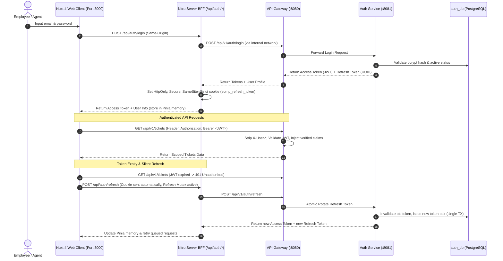
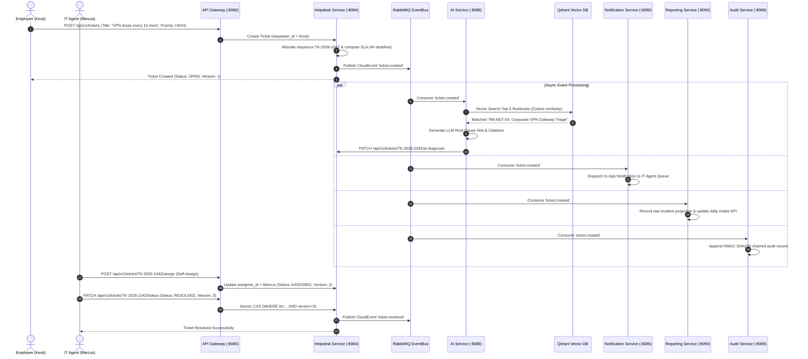
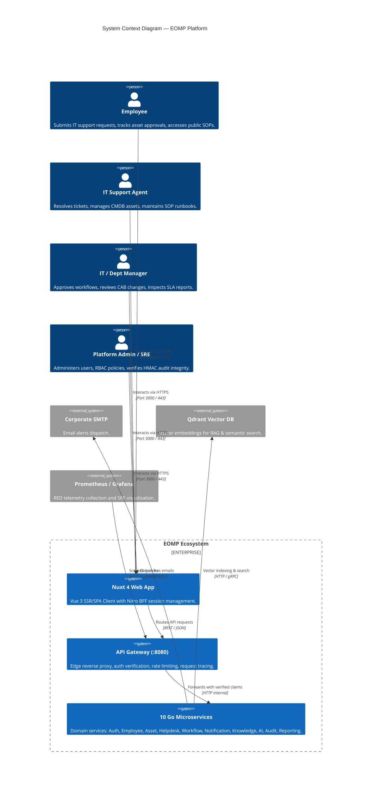
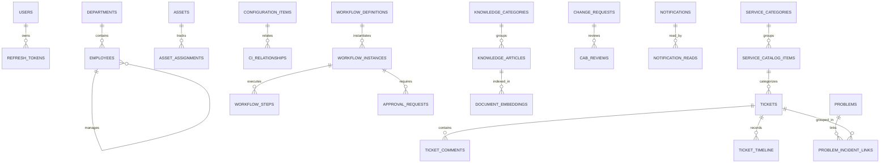

# Enterprise Operations Management Platform (EOMP) — Master Project Documentation

> **Document Type:** Master Architectural Specification & Single Source of Truth  
> **Target Audience:** Software Architects, Tech Leads, Business Analysts, Project Managers, Full-Stack Engineers, Mobile Engineers, QA/QC, DevOps/SRE, and AI Coding Agents  
> **Status:** Active & Evidence-Aligned Baseline  
> **Current Version:** `0.1.0-dev` (Remediation Baseline)

---

## 📑 Table of Contents

1. [Project Overview](#1-project-overview)
2. [Actors & User Roles](#2-actors--user-roles)
3. [Core Features](#3-core-features)
4. [Complete User Flows](#4-complete-user-flows)
5. [System Architecture](#5-system-architecture)
6. [Repository Structure & Navigation Guide](#6-repository-structure--navigation-guide)
7. [Backend Architecture](#7-backend-architecture)
8. [Frontend Architecture](#8-frontend-architecture)
9. [Mobile Architecture](#9-mobile-architecture)
10. [AI Architecture & RAG Pipeline](#10-ai-architecture--rag-pipeline)
11. [Database & Persistence](#11-database--persistence)
12. [API Overview & Route Matrix](#12-api-overview--route-matrix)
13. [State Machines & Lifecycle Flows](#13-state-machines--lifecycle-flows)
14. [Environment & Local Setup Guide](#14-environment--local-setup-guide)
15. [Development & Delivery Workflow](#15-development--delivery-workflow)
16. [Coding Conventions & Standards](#16-coding-conventions--standards)
17. [Definition of Done (DoD)](#17-definition-of-done-dod)
18. [Release Verification Change Record](#18-release-verification-change-record--2026-09-02)

---

## 1. Project Overview

### 1.1. Project Name & Mission
**EOMP (Enterprise Operations Management Platform)** is an enterprise-grade, microservices-based IT Operations and Service Management platform (ITSM/ITIL v4 compliant) integrated with an AI Copilot engine for automated incident triage, retrieval-augmented generation (RAG) on IT standard operating procedures (SOPs), multi-level approval workflows, hardware/software CMDB lifecycle management, immutable HMAC-SHA256 audit trails, and real-time operational analytics.

### 1.2. Business Problem
Large enterprises struggle with fragmented operational silos:
- **Disjointed Incident Tracking:** Employees submit requests via scattered channels (chat, email, phone) without standardized SLA tracking, leading to missed escalation deadlines.
- **Untracked Hardware & Software Assets:** IT assets lack lifecycle tracking, causing lost equipment, expired warranties, and license non-compliance.
- **Manual, Slow Approvals:** Equipment requisition and access permissions depend on slow manual chains without formal CAB (Change Advisory Board) voting.
- **Siloed Knowledge & Repetitive Support:** Level-1 IT support agents waste hours diagnosing recurring issues instead of utilizing instant vector-indexed runbooks.
- **Security & Compliance Risks:** Insecure identity headers, mutable audit logs, and uncontrolled cross-department data visibility violate compliance standards (SOC2, ISO 27001).

### 1.3. Product Vision & Core Objectives
EOMP establishes a secure, zero-trust, resilient, and observable operational backbone:
1. **Zero-Trust Identity Boundary:** Strict API Gateway enforcement where client-supplied identity headers (`X-User-*`) are stripped unconditionally, and verified claims are injected exclusively from validated JWT tokens.
2. **Fine-Grained Row-Level & Scope Authorization:** Fail-closed data access scoped strictly by role and department (`own`, `assigned`, `queue`, `department`, `all`).
3. **AI-Augmented Operations:** Automated ticket triage, priority scoring, root cause analysis hints, and RAG contextual answers with explicit runbook citations.
4. **Data Integrity & Concurrency Safety:** Optimistic locking via Compare-And-Swap (`version` column), atomic PostgreSQL sequences for human-readable codes (`TK-*`, `AST-*`, `WFI-*`, `CHG-*`), and tamper-evident chained HMAC-SHA256 audit logs.
5. **Event-Driven Resilience:** Asynchronous cross-service event propagation via RabbitMQ AMQP 4 with dead-lettering and idempotent consumer processing.

### 1.4. Project Scope
- **Backend:** 11 microservices written in Go 1.24+ following Clean/Hexagonal Architecture.
- **Frontend:** Nuxt 4 (Vue 3 Composition API, TypeScript, Tailwind CSS v4, Pinia) with a secure Nitro BFF session layer.
- **Persistence:** 9 isolated PostgreSQL 17 databases (Database-per-Service), Redis 7 (caching/sessions), Qdrant (vector embeddings), and MinIO (S3 object storage).
- **Observability & SRE:** Prometheus RED metrics, Grafana dashboards, Loki log aggregation, Docker Compose, Kubernetes manifests, Helm charts, and automated Disaster Recovery (DR) tooling.
- **Mobile (Future Integration):** Cross-platform mobile architecture connecting through the API Gateway REST APIs.

---

## 2. Actors & User Roles

EOMP defines **4 Human Roles** and **2 System Actors**. All authorization follows the principle of least privilege:

```
┌────────────────────────────────────────────────────────────────────────┐
│                        EOMP RBAC & SCOPE HIERARCHY                     │
├────────────────────────────────┬───────────────────────────────────────┤
│ ROLE_ADMIN                     │ Global Scope ('all')                  │
│  └─► ROLE_MANAGER              │ Department Scope ('department')       │
│       └─► ROLE_AGENT           │ Assigned + Queue ('assigned' + 'queue')│
│            └─► ROLE_EMPLOYEE   │ Own Creator Scope ('own')             │
└────────────────────────────────┴───────────────────────────────────────┘
```

### 2.1. `ROLE_EMPLOYEE` (End-User / Requester)
- **Who they are:** Regular enterprise employees requiring IT assistance or equipment.
- **What they can do:**
  - Create incident and service requests for themselves.
  - View, track, and comment on their **own** tickets (`scope: own`).
  - Search and read **public** Knowledge Base articles and SOPs.
  - Interact with AI Copilot for self-service troubleshooting.
  - Request hardware/software workflows and track their approval progress.
  - View and edit their own employee profile; view same-department colleagues' name and email.
- **What they cannot do:**
  - Access tickets created by colleagues (even within the same department).
  - View internal IT technician comments or internal notes.
  - Access Asset/CMDB inventory, Problem management, Audit trails, or BI reports.
  - Approve workflow instances or change requests.
  - Modify system configurations or user accounts.

### 2.2. `ROLE_AGENT` (IT Support Specialist / L1-L2 Agent)
- **Who they are:** Helpdesk technicians and IT operations staff responsible for resolving issues.
- **What they can do:**
  - View tickets assigned to themselves + unassigned tickets in the global queue (`scope: assigned + queue`).
  - Self-assign tickets from the unassigned queue.
  - Update ticket status (`IN_PROGRESS`, `WAITING_USER`, `RESOLVED`) and record work notes.
  - Create and manage hardware/software assets in the CMDB (`scope: all` read, assign/return).
  - Create and update ITIL Problems linked to recurring incidents.
  - Create and maintain internal & public Knowledge Base articles and runbooks.
  - View the complete employee directory.
- **What they cannot do:**
  - View tickets assigned to other agents once assigned (unless re-assigned by a Manager/Admin).
  - Approve multi-step workflows or vote on Change Advisory Board (CAB) reviews without manager elevation.
  - Manage global user accounts, system configuration, or audit log verification.

### 2.3. `ROLE_MANAGER` (Department & IT Manager)
- **Who they are:** Department heads, IT leads, and service delivery managers.
- **What they can do:**
  - View and manage all tickets within their assigned department (`scope: department`).
  - Approve or reject multi-step workflow requests assigned to their department or role pool.
  - Review and vote on Change Requests (CAB reviews).
  - Manage department employee records and view user accounts within their department.
  - Access department-level SLA compliance, MTTR/MTTD analytics, and export CSV/PDF reports.
  - Inspect audit logs and verify HMAC cryptographic integrity.
- **What they cannot do:**
  - Access data of other departments without explicit administrative assignment.
  - Modify global secrets, tamper with append-only audit tables, or bypass audit logging.

### 2.4. `ROLE_ADMIN` (System Administrator & Platform/SRE Lead)
- **Who they are:** Platform administrators, security officers, and SRE team members.
- **What they can do:**
  - Full system-wide access across all 11 microservices (`scope: all`).
  - Create, update, assign roles, and deactivate user accounts across any department.
  - Reset user credentials and revoke active refresh tokens and sessions.
  - Configure workflow definitions, service catalogs, and SLA thresholds.
  - Perform HMAC-SHA256 audit integrity verification and inspect security events.
  - Run database migrations, execute disaster recovery drills, and manage Kubernetes deployments.
- **What they cannot do:**
  - Modify or delete existing immutable audit records in `audit_db` (enforced by DB triggers and HMAC chain).

### 2.5. `AI Service` (System Actor)
- Background and on-demand assistant. Analyzes ticket title/description to predict category, priority, and confidence score. Retrieves vector embeddings from Qdrant to generate SOP recommendations. Always sets `requires_human_review: true`.

### 2.6. `System Workers` (Background Jobs)
- Automated workers executing SLA deadline calculations, RabbitMQ event consumption, reporting rollups, and auto-closing `RESOLVED` tickets after 5 business days of inactivity.

---

## 3. Core Features

### 3.1. Authentication & Secure Session Management
- **Purpose:** Secure identity verification, JWT lifecycle management, refresh token rotation, and anti-CSRF protection.
- **Actor:** All Actors (`ROLE_EMPLOYEE`, `ROLE_AGENT`, `ROLE_MANAGER`, `ROLE_ADMIN`).
- **Input:** Email, Password, Refresh Token cookie.
- **Process:**
  1. Login verifies bcrypt hash in `auth_db.users`.
  2. Issues short-lived Access Token (JWT, 15m) and long-lived Refresh Token (UUID, 7d).
  3. Nuxt Nitro BFF stores Refresh Token in an `HttpOnly`, `Secure`, `SameSite=Strict`, `Path=/api/auth` cookie (`eomp_refresh_token`).
  4. Access token resides strictly in client Pinia memory (never in `localStorage`).
  5. Refresh requests execute atomic rotation in a single SQL transaction. Replaying an old token immediately revokes the session family and returns `401`.
  6. Concurrent 401s on the frontend are serialized through a client-side Refresh Mutex.
- **Output:** Authenticated user session, valid JWT claims, user profile.
- **Business Rules:** Password minimum 8 characters; `JWT_SECRET` must be >= 32 characters; Public registration restricted to `ROLE_EMPLOYEE` in development and disabled in production.
- **Permissions:** Public: `/login`, `/refresh`, `/logout`. Protected: `/me`, `/change-password`.
- **Related Modules:** `services/auth`, `services/gateway`, `apps/web/server/api/auth`, `apps/web/app/stores/auth.ts`.
- **Current Status:** **Completed & Runtime Verified**.

### 3.2. User Lifecycle & Access Administration
- **Purpose:** Administration of user accounts, role assignments, department bindings, and immediate session revocation upon deactivation.
- **Actor:** `ROLE_ADMIN`, `ROLE_MANAGER` (read department users).
- **Input:** User profile DTO (`email`, `name`, `role`, `department_id`, `is_active`).
- **Process:** Admin creates user with explicit role and active department reference. Self-role elevation is blocked (`403`). User deactivation immediately revokes all refresh tokens and logs a security audit event in the same transaction.
- **Output:** Created/Updated user record, revoked sessions.
- **Business Rules:** Self-promotion blocked; production creation requires valid `department_id`; deactivation is immediate and irreversible by non-admins.
- **Permissions:** Admin: full user CRUD; Manager: department user listing.
- **Related Modules:** `services/auth`, `services/gateway`, `services/employee`.
- **Current Status:** **Completed & Runtime Verified**.

### 3.3. IT Helpdesk & Incident Management
- **Purpose:** Full ITIL incident and request fulfillment lifecycle, SLA calculation, ticket assignment, and commenting.
- **Actor:** `ROLE_EMPLOYEE`, `ROLE_AGENT`, `ROLE_MANAGER`, `ROLE_ADMIN`.
- **Input:** Ticket title, description, category (`Hardware`, `Software`, `Network`, `Account`), priority (`LOW`, `MEDIUM`, `HIGH`, `URGENT`), service catalog item.
- **Process:**
  1. Creation generates unique sequential `TK-YYYY-NNNN` code via PostgreSQL sequence.
  2. Dynamically calculates SLA response and resolution deadlines based on business hours (08:00–17:30 Mon–Fri; 24/7 for URGENT).
  3. Publishes `ticket.created` event to RabbitMQ.
  4. Agent self-assigns from queue or Manager assigns to Agent.
  5. State transitions validated by ITIL state machine (`OPEN` → `ASSIGNED` → `IN_PROGRESS` → `WAITING_USER` → `RESOLVED` → `CLOSED`).
  6. Updates use Optimistic Concurrency Control (`version` column). Outdated version returns `409 Conflict`.
- **Output:** Managed ticket lifecycle, SLA timeline, threaded comments, audit trail.
- **Business Rules:** Employee only sees own tickets; out-of-scope query returns `404 Not Found`; employee comments cannot be internal; `WAITING_USER` pauses SLA clock; auto-close executes after 5 business days of resolution.
- **Permissions:** Scope matrix enforced in SQL queries per role.
- **Related Modules:** `services/helpdesk`, `services/notification`, `services/reporting`, `services/audit`, `services/ai`.
- **Current Status:** **Completed & Runtime Verified**.

### 3.4. ITIL Problem Management & Root Cause Analysis
- **Purpose:** Identify root causes of recurring incidents, document workarounds, and track known errors.
- **Actor:** `ROLE_AGENT`, `ROLE_MANAGER`, `ROLE_ADMIN`.
- **Input:** Problem title, description, category, root cause analysis (RCA), workaround, linked ticket IDs.
- **Process:** Sequential `PRB-YYYY-NNNN` generated. Links multiple incident tickets to a single problem. When problem is resolved, linked incidents can be resolved in bulk.
- **Output:** Problem record, known error database entry, resolved incident cluster.
- **Business Rules:** Employee has no access (`403`); updates protected by optimistic CAS locking (`version`).
- **Permissions:** Agent/Manager/Admin.
- **Related Modules:** `services/helpdesk`.
- **Current Status:** **Completed & Runtime Verified**.

### 3.5. Asset Lifecycle & CMDB Configuration Items
- **Purpose:** Track IT hardware, software licenses, configurations, and dependency relationships.
- **Actor:** `ROLE_AGENT`, `ROLE_MANAGER`, `ROLE_ADMIN`.
- **Input:** Asset tag (`AST-*`), name, category, serial number, purchase cost, warranty date, CI relationships.
- **Process:** Tracks asset status (`IN_STOCK`, `ASSIGNED`, `MAINTENANCE`, `RETIRED`). Assignment links asset to an employee and updates CMDB configuration item (`CI-*`) topology graph.
- **Output:** Asset register, employee assignment history, CI dependency tree.
- **Business Rules:** Employee direct calls return `403`; state changes use optimistic locking.
- **Permissions:** Agent/Manager/Admin.
- **Related Modules:** `services/asset`, `services/employee`, `services/audit`.
- **Current Status:** **Completed & Runtime Verified**.

### 3.6. Multi-Step Workflow Engine & CAB Change Management
- **Purpose:** Define and execute multi-step approval workflows (equipment requisitions, access grants) and ITIL Change Advisory Board (CAB) voting.
- **Actor:** All Actors (Requester: Employee; Approvers: Manager, CAB Members, Admin).
- **Input:** Workflow definition ID, form payload, approval decisions (`APPROVED`, `REJECTED`, comments).
- **Process:**
  1. Instantiates `WFI-YYYY-NNNN` with atomic state.
  2. Steps executed sequentially; approver notified via RabbitMQ event.
  3. Approver records vote; if approved, advances to next step until `COMPLETED`.
  4. Change requests (`CHG-YYYY-NNNN`) require CAB voting threshold (quorum >= 2 for Major/Emergency).
- **Output:** Completed workflow instance, audit trail, updated downstream resources.
- **Business Rules:** Employee only views own workflow instances; approval requires matching approver ID or role pool; CAB identity verified from authenticated JWT.
- **Permissions:** Enforced by workflow handler and repository scoping.
- **Related Modules:** `services/workflow`, `services/notification`, `services/audit`.
- **Current Status:** **Completed & Runtime Verified**.

### 3.7. Knowledge Base & SOP Runbooks
- **Purpose:** Centralized IT documentation, SOP runbooks, and vector search indexing.
- **Actor:** All Actors (Employee: public articles; Agent/Manager/Admin: public + internal + runbooks).
- **Input:** Title, slug, markdown content, category, tags, visibility (`is_published`, `is_internal`), SOP steps JSON.
- **Process:** Articles stored in `knowledge_db`. Background ingestion chunks text, generates 768-dim embeddings, and syncs to Qdrant vector database collection `knowledge_base`.
- **Output:** Searchable knowledge repository, semantic vector similarity results.
- **Business Rules:** Employee searches filtered to public articles in SQL before vector ingestion; internal queries by unauthorized roles return `404` without incrementing view count.
- **Permissions:** Scoped read access; Agent/Manager/Admin write access.
- **Related Modules:** `services/knowledge`, `services/ai`, `infrastructure/qdrant`.
- **Current Status:** **Completed & Runtime Verified**.

### 3.8. AI Operations Copilot (Triage & RAG)
- **Purpose:** AI assistant for automated ticket classification, priority recommendation, and conversational troubleshooting with SOP citations.
- **Actor:** `ROLE_EMPLOYEE` (self-service chat), `ROLE_AGENT` / `ROLE_MANAGER` (ticket triage).
- **Input:** Ticket title & description (triage) or conversational user prompt (chat).
- **Process:**
  1. Triage: Prompt template extracts category, priority, and confidence score.
  2. Chat/RAG: Computes prompt vector embedding, queries Qdrant Top-3 matching SOP chunks, injects context into LLM, and formats response with explicit `Citation` references (`article_id`, `title`).
  3. Production defaults to OpenAI/Ollama; mock provider disabled unless `ALLOW_MOCK_AI=true`.
- **Output:** Structured JSON triage diagnosis, natural language advice with citations.
- **Business Rules:** AI outputs flag `requires_human_review: true`; no fabricated fallback data on backend error.
- **Permissions:** All authenticated users.
- **Related Modules:** `services/ai`, `services/knowledge`, `infrastructure/qdrant`.
- **Current Status:** **Completed & Runtime Verified**.

### 3.9. Notification Engine
- **Purpose:** Centralized multi-channel notification dispatch (In-App, SSE, SMTP Email).
- **Actor:** All Actors (recipients of system events).
- **Input:** Domain events from RabbitMQ (`ticket.created`, `workflow.approved`, `sla.warning`).
- **Process:** Consumes AMQP messages, formats notification template, writes to `notification_db.notifications`, and pushes realtime alert. Read receipts tracked per user in `notification_reads`.
- **Output:** In-app notification badge, email alert, read receipt.
- **Business Rules:** Notifications are recipient-scoped; mark-as-read enforces ownership.
- **Permissions:** Users manage own notifications; Admin can broadcast.
- **Related Modules:** `services/notification`, `infrastructure/rabbitmq`.
- **Current Status:** **Completed & Runtime Verified**.

### 3.10. Immutable Audit Trail & Compliance Verification
- **Purpose:** Tamper-evident recording of all system mutations and authentication events.
- **Actor:** `ROLE_MANAGER`, `ROLE_ADMIN`, Compliance Officers.
- **Input:** Event action, actor ID, IP, resource type/ID, old/new JSON payloads.
- **Process:**
  1. Computes cryptographic HMAC-SHA256 checksum chained to the previous record (`hash(prev_checksum + current_data, key)`).
  2. Table `audit_logs` is append-only; database trigger blocks direct `UPDATE`/`DELETE`.
  3. Endpoint `/api/v1/audit/integrity` traverses and verifies the entire cryptographic chain.
- **Output:** Verified audit log, tamper detection alert (`409 Conflict` on corrupted chain).
- **Business Rules:** Minimum 32-character HMAC key; audit insert errors trigger transaction rollback.
- **Permissions:** Manager and Admin only (`403` for others).
- **Related Modules:** `services/audit`, `services/gateway`.
- **Current Status:** **Completed & Runtime Verified**.

### 3.11. Reporting & BI Analytics
- **Purpose:** Operational metrics, Mean Time to Detect (MTTD), Mean Time to Resolve (MTTR), SLA compliance percentages, daily trends, and CSV/PDF export.
- **Actor:** `ROLE_MANAGER` (department scope), `ROLE_ADMIN` (global scope).
- **Input:** Date range (`start_date`, `end_date`, `range=7d|30d|90d`), department filter.
- **Process:** RabbitMQ consumer updates `reporting_processed_events` and rolls up raw incident projections into daily KPI tables idempotently. Queries execute with parameter-driven date filters.
- **Output:** Analytics JSON, dynamic CSV export, structured PDF report.
- **Business Rules:** Excludes fabricated CSAT and mock constants; queries enforce role/department scoping.
- **Permissions:** Manager and Admin only.
- **Related Modules:** `services/reporting`, `services/helpdesk`, `infrastructure/rabbitmq`.
- **Current Status:** **Completed & Runtime Verified**.

### 3.12. Observability & SRE Health Monitoring
- **Purpose:** Infrastructure and microservice health probes, RED metrics telemetry, and centralized logging.
- **Actor:** `ROLE_ADMIN`, DevOps/SRE Engineers.
- **Input:** HTTP health probes, Prometheus metrics scrape.
- **Process:** Gateway probes `/health` across all 11 services; exposes live status and latency. RED metrics scraped by Prometheus and visualized in Grafana.
- **Output:** SRE status dashboard, Prometheus `/metrics`, Grafana heatmaps.
- **Business Rules:** Monitoring endpoints restricted; log API explicitly returns `501 Not Implemented` until Loki backend proxy is connected.
- **Permissions:** Admin only.
- **Related Modules:** `services/gateway`, `infrastructure/prometheus`, `infrastructure/grafana`, `infrastructure/loki`.
- **Current Status:** **Partially Implemented & Runtime Verified** — health/metrics infrastructure is active; the authenticated Loki/Prometheus query proxy remains tracked as `TASK-BKL-008`.

---

## 4. Complete User Flows

### Flow 1: Secure Authentication & Session Rotation


### Flow 2: Incident Creation, AI Triage, RAG & Resolution Lifecycle


---

## 5. System Architecture

EOMP follows a **Domain-Driven Microservices Architecture** with independent persistence per service and unified edge ingress.

### 5.1. High-Level C4 Context Diagram


### 5.2. Container & Infrastructure Topology
```
                              ┌────────────────────────┐
                              │  Client Browser / App  │
                              └───────────┬────────────┘
                                          │ HTTPS (443 / 3000)
                                          ▼
                              ┌────────────────────────┐
                              │  Nuxt 4 Web Client     │
                              │  Nitro Server BFF      │
                              └───────────┬────────────┘
                                          │ REST API (JSON)
                                          ▼
┌────────────────────────────────────────────────────────────────────────────────────────┐
│                              API GATEWAY SERVICE (:8080)                               │
│       Middleware: StripIdentityHeaders · Logger · Recoverer · GatewayAuth · RateLimit │
└────────┬──────────┬──────────┬──────────┬──────────┬──────────┬──────────┬────────┬────┘
         │          │          │          │          │          │          │        │
         │ :8081    │ :8082    │ :8083    │ :8084    │ :8085    │ :8086    │ :8087  │ :8088
         ▼          ▼          ▼          ▼          ▼          ▼          ▼        ▼
     ┌───────┐  ┌───────┐  ┌───────┐  ┌───────┐  ┌───────┐  ┌───────┐  ┌───────┐┌───────┐
     │ Auth  │  │Employ-│  │ Asset │  │ Help- │  │ Work- │  │Notifi-│  │ Know- ││  AI   │
     │Service│  │  ee   │  │Service│  │ desk  │  │ flow  │  │cation │  │ ledge ││Service│
     └───┬───┘  └───┬───┘  └───┬───┘  └───┬───┘  └───┬───┘  └───┬───┘  └───┬───┘└───┬───┘
         │          │          │          │          │          │          │        │
         ▼          ▼          ▼          ▼          ▼          │          ▼        ▼
     ┌───────┐  ┌───────┐  ┌───────┐  ┌───────┐  ┌───────┐      │      ┌───────┐┌───────┐
     │auth_db│  │employ-│  │asset_ │  │help-  │  │work-  │      │      │know-  ││Qdrant │
     │       │  │ee_db  │  │db     │  │desk_db│  │flow_db│      │      │ledge  ││Vector │
     └───────┘  └───────┘  └───────┘  └───────┘  └───────┘      │      │_db    ││DB     │
         │          │          │          │          │          │      └───────┘└───────┘
         └──────────┴──────────┴──────────┴──────────┴──────────┴──────────┴────────┤
                                              │                                     │
                                    ┌─────────▼────────┐                            │
                                    │ RabbitMQ Events  │◄───────────────────────────┘
                                    │ (Topic Exchange) │
                                    └─────────┬────────┘
                                              │
                      ┌───────────────────────┴───────────────────────┐
                      ▼                                               ▼
              ┌──────────────┐                                ┌──────────────┐
              │Audit Service │(:8089)                         │Reporting Svc │(:8090)
              │ └► audit_db  │                                │ └► reporting │
              └──────────────┘                                └──────────────┘
```

---

## 6. Repository Structure & Navigation Guide

```
d:/IT_help/eomp/
├── .env.example                 # Standardized environment template (No plaintext secrets)
├── docker-compose.yml           # Local infrastructure stack (Postgres, Redis, RabbitMQ, MinIO, Qdrant, Prometheus, Grafana, Loki)
├── go.work                      # Multi-module Go workspace linking 13 modules
├── Jenkinsfile                  # CI/CD pipeline definition with fail-closed security gates
├── Makefile                     # Cross-platform development and build tasks
├── README.md                    # Project landing documentation
│
├── apps/
│   └── web/                     # Frontend Application (Nuxt 4 / Vue 3 / Pinia / Tailwind CSS v4)
│       ├── app/
│       │   ├── composables/     # Vue composables (useApi.ts, useAuth.ts, useToast.ts)
│       │   ├── layouts/         # Layout components (default.vue with RBAC navigation)
│       │   ├── middleware/      # Global route guards (auth.global.ts)
│       │   ├── pages/           # File-based routes (index, helpdesk, assets, employees, workflows, knowledge, ai, audit, reports)
│       │   ├── stores/          # Pinia state stores (auth.ts with memory token)
│       │   ├── types/           # TypeScript interfaces and contracts
│       │   └── utils/           # Utilities (refresh-mutex.ts, date formatters)
│       ├── server/
│       │   └── api/auth/        # Nitro BFF endpoints (login.post.ts, refresh.post.ts, logout.post.ts, me.get.ts)
│       └── nuxt.config.ts       # Nuxt configuration and proxy definitions
│
├── packages/
│   ├── proto/                   # gRPC Protocol Buffers definitions (common.proto)
│   └── shared/                  # Core Go library shared by all 11 microservices
│       ├── pkg/
│       │   ├── config/          # Environment variable loaders with fail-fast validation
│       │   ├── database/        # PostgreSQL connection pool & auto-migration with advisory locks
│       │   ├── errors/          # Sanitized error envelopes with request_id correlation
│       │   ├── eventbus/        # RabbitMQ AMQP 4 driver & in-memory test double
│       │   ├── logger/          # Go log/slog structured JSON logging
│       │   ├── middleware/      # GatewayAuth, StripIdentityHeaders, RequireRoles, Recoverer, CORS, RateLimit
│       │   ├── redis/           # Redis client wrapper with fallback
│       │   └── response/        # Standard paginated and error response writers
│
├── services/                    # 11 Go Microservices
│   ├── ai/                      # AI Assistant, Qdrant vector retrieval, ticket triage (:8088)
│   ├── asset/                   # Asset lifecycle, CMDB topology, assignments (:8083)
│   ├── audit/                   # Chained HMAC-SHA256 immutable audit logging (:8089)
│   ├── auth/                    # User authentication, JWT issuance, password & role management (:8081)
│   ├── employee/                # Employee directory, departments, org chart (:8082)
│   ├── gateway/                 # API Gateway reverse proxy, routing, rate limiting (:8080)
│   ├── helpdesk/                # ITIL Helpdesk, tickets, SLA engine, problem management (:8084)
│   ├── knowledge/               # Knowledge articles, SOP runbooks, vector sync (:8087)
│   ├── notification/            # In-App, SSE, SMTP email dispatch center (:8086)
│   ├── reporting/               # BI metrics, SLA rollups, CSV/PDF export engine (:8090)
│   └── workflow/                # Multi-step approval state machine & CAB change requests (:8085)
│
├── infrastructure/              # Infrastructure configurations
│   ├── grafana/                 # Grafana datasource and dashboard provisioning
│   ├── loki/                    # Loki log retention and storage configurations
│   ├── minio/                   # MinIO object storage bucket initialization
│   ├── postgres/                # PostgreSQL multi-database init script (01-init-databases.sql)
│   ├── prometheus/              # Prometheus metric scraping and alert rules
│   └── rabbitmq/                # RabbitMQ topic definitions and plugins
│
├── deploy/                      # Deployment configurations
│   ├── docker/                  # Dockerfile definitions (Dockerfile.go-service)
│   ├── docker-compose.prod.yml  # Hardened production Compose manifest
│   ├── k6/                      # Load and stress testing scripts
│   ├── kubernetes/              # K8s manifests (NetworkPolicies, PDBs, Deployments)
│   └── nginx/                   # Reverse proxy configuration with TLS & security headers
│
├── scripts/                     # Automation & verification scripts
│   ├── backup_restore.ps1/.sh   # 9-Database automated disaster recovery drill
│   ├── check_openapi_coverage.go# Runtime vs OpenAPI parity validation gate
│   ├── dev.ps1                  # Local developer automation (docker, health, test)
│   ├── dev_seed.ps1/.sh         # Idempotent development seed fixtures
│   └── staging_verify.ps1/.sh   # Automated verification test suite
│
└── docs/                        # Master Documentation Directory
    ├── PROJECT_DOCUMENTATION.md # [THIS FILE] Single Source of Truth
    ├── AI_DEVELOPMENT_RULES.md  # System instructions and 11-step workflow for AI agents
    ├── CURRENT_TASKS.md         # Active and remaining open tasks tracker
    ├── openapi/                 # OpenAPI 3.0 specification hub (eomp-openapi-spec.yaml)
    └── evidence/                # Automated verification evidence artifacts
```

### 6.1. "Where Do I Find Code?" — Intern Quick Guide
- **To modify Ticket SLA calculations:** Go to `services/helpdesk/internal/service/sla_engine.go`.
- **To update Auth JWT signing or refresh rotation:** Go to `services/auth/internal/service/auth_service.go`.
- **To adjust Gateway header stripping or role guards:** Go to `services/gateway/internal/middleware/auth.go`.
- **To customize AI prompts or Qdrant vector search:** Go to `services/ai/internal/prompt/prompt.go` and `services/ai/internal/rag/retriever.go`.
- **To add a Database migration:** Create `00X_description.sql` in `services/<service_name>/migrations/`.
- **To update Frontend API state handling:** Go to `apps/web/app/composables/useApi.ts` and `apps/web/app/components/ApiStatePanel.vue`.

---

## 7. Backend Architecture

### 7.1. Clean / Hexagonal Layering
Every microservice implements a strict 4-layer architecture:
1. **Presentation / Handler Layer (`internal/handler`):**
   - Decodes HTTP JSON request payloads and validates DTO structs.
   - Extracts authenticated actor from request context (`middleware.GetActor(r.Context())`).
   - Delegates business execution to domain services.
   - Encodes standardized JSON response envelopes via `packages/shared/pkg/response`.
2. **Business / Domain Service Layer (`internal/service`):**
   - Pure business logic, ITIL state machine enforcement, SLA calculations, and cryptographic operations.
   - Coordinates multi-table SQL transactions.
   - Dispatches asynchronous domain events via `eventbus.EventBus`.
3. **Persistence / Repository Layer (`internal/repository`):**
   - Direct PostgreSQL operations using parameterized SQL queries.
   - Implements optimistic concurrency control (CAS) via `WHERE id = $1 AND version = $2`.
   - Never exposes SQL queries outside the repository layer.
4. **Data Model Layer (`internal/model`):**
   - Defines Go structs, JSON tags, DTOs, and domain enums.

### 7.2. Shared Database Migration Runner
Migrations are executed automatically on service startup via `packages/shared/pkg/database/postgres.go`:
- Obtains a PostgreSQL dedicated session advisory lock (`pg_advisory_lock(8424119472649191)`).
- Scans `services/<service>/migrations/*.sql` in alphanumeric order.
- Applies pending migrations inside individual database transactions.
- Records executed migrations in `schema_migrations`.
- Releases advisory lock on completion.

---

## 8. Frontend Architecture

### 8.1. Technology Foundation
- **Framework:** Nuxt 4 (Vue 3 Composition API, TypeScript, Vite).
- **Styling:** Tailwind CSS v4 + Nuxt UI (Dark modern aesthetic, Slate palette, Glassmorphism, Micro-animations).
- **State Management:** Pinia stores (`auth.ts`, `ui.ts`).

### 8.2. Nitro BFF & Session Security Architecture
To mitigate token theft via XSS:
- **Refresh Token Isolation:** The browser never accesses the refresh token in JavaScript. Nitro server endpoints (`/api/auth/*`) receive and store the token in an `HttpOnly`, `Secure`, `SameSite=Strict` cookie.
- **Access Token in Memory:** The short-lived JWT access token is held strictly in Pinia store memory.
- **CSRF Exact-Origin Verification:** All mutating auth endpoints verify the `Origin` header against the expected client host.
- **Refresh Mutex (`apps/web/app/utils/refresh-mutex.ts`):** When multiple concurrent API requests encounter an expired access token (401), the mutex intercepts them, triggers exactly **one** silent refresh request, and seamlessly replays all queued requests with the new token.

### 8.3. Global Route Guard & API State Classifier
- **Route Guard (`apps/web/app/middleware/auth.global.ts`):** Enforces client-side route navigation based on user role (`/audit`, `/reports`, `/monitoring`, `/assets`). Backend remains the authoritative security enforcer.
- **API State Classifier:** Standardizes view states (`loading`, `empty`, `403 forbidden`, `backend unavailable`) across all data screens via `<ApiStatePanel />`.

---

## 9. Mobile Architecture

### 9.1. Current Repository Status
The current repository does not include a dedicated mobile codebase. The backend API Gateway and microservices are architected to support mobile clients natively.

### 9.2. Mobile Architectural Blueprint (Future Implementation)
When implementing native or cross-platform mobile apps (Flutter, React Native, iOS Swift, Android Kotlin):
- **API Entrypoint:** Connects to API Gateway via `https://<api-domain>/api/v1`.
- **Token Storage:** Store Refresh Tokens in OS-level secure storage (**iOS Keychain** / **Android EncryptedSharedPreferences**).
- **Biometric Integration:** Local biometric unlock (FaceID / Fingerprint) guarding the secure token store.
- **Push Notifications:** Notification Service dispatches push payloads via **Firebase Cloud Messaging (FCM)** and **Apple Push Notification service (APNs)** consumed from RabbitMQ events.
- **Attachment Handling:** Mobile clients capture photos/attachments, request a presigned S3 upload URL from Helpdesk Service, and upload directly to MinIO.

---

## 10. AI Architecture & RAG Pipeline

```mermaid
flowchart TD
    subgraph Ingestion["1. Document Ingestion Pipeline"]
        Doc[Knowledge Articles & Runbooks] --> Chunk[Token Chunking 500 tokens]
        Chunk --> EmbedGen[Generate Embeddings nomic-embed-text / OpenAI]
        EmbedGen --> Qdrant[(Qdrant Vector DB collection: knowledge_base)]
    end

    subgraph Runtime["2. Runtime Triage & RAG Execution"]
        Req[User Ticket / Chat Request] --> Triage[AI Ticket Triage & Intent Detection]
        Triage --> VectorSearch[Query Qdrant Cosine Similarity Top-3]
        VectorSearch --> ContextAssembly[RAG Context Assembly & Prompt Formatting]
        ContextAssembly --> LLM[LLM Generation Ollama llama3.2 / OpenAI gpt-4o-mini]
        LLM --> Response[Response with Structured Citations & requires_human_review=true]
    end
```



### 10.1. Provider Abstraction
Interface `LLMProvider` and `EmbeddingProvider` in `services/ai/internal/provider/` support:
1. **OllamaProvider (Local First):** Model `llama3.2` for text generation and `nomic-embed-text` for 768-dim embeddings.
2. **OpenAIProvider (Cloud):** Model `gpt-4o-mini` and `text-embedding-3-small` (1536-dim).
3. **MockProvider:** Strictly for unit testing when `ALLOW_MOCK_AI=true`. In production, mock fallback is disabled.

---

## 11. Database & Persistence

EOMP implements a strict **Database-per-Service** pattern across 9 dedicated PostgreSQL databases:



### 11.1. Managed Databases & Schemas
| Database | Microservice | Key Tables | Concurrency Control |
|---|---|---|---|
| `auth_db` | Auth Service (`:8081`) | `users`, `refresh_tokens`, `login_audit_logs` | Atomic SQL Transactions |
| `employee_db` | Employee Service (`:8082`) | `departments`, `employees` | Optimistic CAS (`version`) |
| `asset_db` | Asset Service (`:8083`) | `assets`, `asset_assignments`, `configuration_items`, `ci_relationships` | Optimistic CAS (`version`) |
| `helpdesk_db` | Helpdesk Service (`:8084`) | `service_categories`, `service_catalog_items`, `tickets`, `ticket_comments`, `ticket_timeline`, `problems`, `problem_incident_links` | Optimistic CAS (`version`) + Sequence Counters |
| `workflow_db` | Workflow Service (`:8085`) | `workflow_definitions`, `workflow_instances`, `workflow_steps`, `approval_requests`, `workflow_logs`, `change_requests`, `cab_reviews` | Optimistic CAS (`version`) + Sequence Counters |
| `notification_db`| Notification Service (`:8086`) | `notifications`, `notification_templates`, `notification_reads` | Composite PK Receipts |
| `knowledge_db` | Knowledge Service (`:8087`) | `knowledge_categories`, `knowledge_articles`, `runbooks`, `document_embeddings` | Optimistic CAS (`version`) |
| `audit_db` | Audit Service (`:8089`) | `audit_logs`, `security_events` | Chained HMAC-SHA256 Append-Only |
| `reporting_db` | Reporting Service (`:8090`) | `sla_metrics_daily`, `agent_performance`, `category_metrics`, `department_sla_metrics`, `raw_incident_records`, `reporting_processed_events` | Idempotent Rollup Projections |

---

## 12. API Overview & Route Matrix

All client requests route through the **API Gateway (`http://localhost:8080/api/v1`)**.

```
┌──────────────────────────┬──────────────┬───────────────────────────────┬────────────────────────┐
│ Domain Group             │ Service Port │ Endpoint Prefix               │ Auth & Role Scope      │
├──────────────────────────┼──────────────┼───────────────────────────────┼────────────────────────┤
│ Authentication           │ :8081        │ /api/v1/auth/*                │ Public / JWT Bearer    │
│ User Management          │ :8081        │ /api/v1/users/*               │ Admin / Manager        │
│ Employee Directory       │ :8082        │ /api/v1/employees/*, /dept/*  │ JWT (Scoped)           │
│ Asset & CMDB             │ :8083        │ /api/v1/assets/*, /cmdb/*     │ Agent, Manager, Admin  │
│ Helpdesk & ITSM          │ :8084        │ /api/v1/tickets/*, /problems/*│ JWT (Scoped Matrix)    │
│ Workflows & CAB          │ :8085        │ /api/v1/workflows/*, /changes/│ JWT (Scoped Matrix)    │
│ Notification Center      │ :8086        │ /api/v1/notifications/*       │ JWT (Recipient-Scoped) │
│ Knowledge Base & SOP     │ :8087        │ /api/v1/knowledge/*           │ JWT (Public/Internal)  │
│ AI Operations Copilot    │ :8088        │ /api/v1/ai/*                  │ JWT Bearer             │
│ Audit Trail Compliance   │ :8089        │ /api/v1/audit/*               │ Manager, Admin Only    │
│ Reporting & BI Analytics │ :8090        │ /api/v1/reports/*             │ Manager, Admin Only    │
│ SRE Observability Probes │ :8080        │ /api/v1/monitoring/*          │ Admin Only             │
└──────────────────────────┴──────────────┴───────────────────────────────┴────────────────────────┘
```

---

## 13. State Machines & Lifecycle Flows

### 13.1. ITIL Incident Ticket State Machine
```
[ OPEN ] ──(Assign)──► [ ASSIGNED ] ──(Start Work)──► [ IN_PROGRESS ]
                             │                               │
                             │                         (Need Info)
                             │                               ▼
                             └────────────────────────► [ WAITING_USER ] (SLA Clock Paused)
                                                             │
                                                        (User Replied)
                                                             ▼
                                                       [ IN_PROGRESS ]
                                                             │
                                                        (Fix Applied)
                                                             ▼
                                                       [ RESOLVED ]
                                                             │
                                                  (5 Days Inactivity)
                                                             ▼
                                                       [ CLOSED ]
```
- **Valid Transitions:**
  - `OPEN` → `ASSIGNED`, `IN_PROGRESS`, `CLOSED` (Cancelled)
  - `ASSIGNED` → `IN_PROGRESS`, `WAITING_USER`, `RESOLVED`
  - `IN_PROGRESS` → `WAITING_USER`, `RESOLVED`
  - `WAITING_USER` → `IN_PROGRESS`, `RESOLVED`
  - `RESOLVED` → `CLOSED`, `IN_PROGRESS` (Re-opened within 5 days)
  - `CLOSED` → Terminal state (no further transitions allowed).

### 13.2. ITIL Change Request (CAB) State Machine
```
[ DRAFT ] ──► [ SUBMITTED ] ──► [ CAB_REVIEW ] ──(Quorum Reached)──► [ APPROVED ] ──► [ SCHEDULED ]
                                      │                                                     │
                                 (Rejected)                                            (Executing)
                                      ▼                                                     ▼
                                 [ REJECTED ]                                        [ IMPLEMENTING ]
                                                                                            │
                                                                                       (Completed)
                                                                                            ▼
                                                                                       [ REVIEWED ] ──► [ CLOSED ]
```

---

## 14. Environment & Local Setup Guide

### 14.1. Prerequisites
- **Git:** >= 2.40
- **Node.js:** >= 20.19 LTS & **pnpm:** >= 10.x
- **Golang:** >= 1.24.x
- **Docker Desktop:** >= 28.x with Compose >= 2.20 (WSL 2 enabled on Windows)

### 14.2. Step-by-Step Setup

#### 1. Clone & Configure Environment
```bash
git clone https://gitlab.com/truonghoang_11/ai-it-help.git
cd ai-it-help/eomp
cp .env.example .env
```

#### 2. Start Infrastructure Containers
```powershell
# Windows PowerShell:
.\scripts\dev.ps1 docker-up
.\scripts\dev.ps1 health

# Linux / macOS:
make docker-up
make health
```

#### 3. Run Development Database Seed
```powershell
# Windows PowerShell:
.\scripts\dev_seed.ps1

# Linux / macOS:
./scripts/dev_seed.sh
```

#### 4. Run Frontend (Nuxt 4)
```bash
cd apps/web
pnpm install
pnpm dev
# Web application available at: http://localhost:3000
```

#### 5. Run Backend Microservices
```bash
# In separate terminal windows:
cd services/gateway && go run ./cmd/server
cd services/auth && go run ./cmd/server
cd services/helpdesk && go run ./cmd/server
cd services/ai && go run ./cmd/server
```

---

## 15. Development & Delivery Workflow

```
┌──────────────┐     ┌──────────────┐     ┌──────────────┐     ┌──────────────┐
│ 1. BA / PM   ├────►│ 2. Architect ├────►│ 3. Implement ├────►│ 4. Test & QA │
│ Requirements │     │ Design & Plan│     │ Code & CAS   │     │ Unit / Int   │
└──────────────┘     └──────────────┘     └──────────────┘     └──────┬───────┘
                                                                      │
┌──────────────┐     ┌──────────────┐     ┌──────────────┐            │
│ 7. Done /    │◄────┤ 6. Staging   │◄────┤ 5. Self-Rev  │◄───────────┘
│ Release      │     │ Verification │     │ & Evidence   │
└──────────────┘     └──────────────┘     └──────────────┘
```

---

## 16. Coding Conventions & Standards

### 16.1. Golang Conventions
- Format code using `gofmt -w .`.
- Check all errors explicitly: `if err != nil { return nil, err }`.
- Never `panic()` inside request handlers. Return structured sanitized errors via `response.Error()`.
- Pass `ctx context.Context` to all database, Redis, and network calls.
- Use `log/slog` for structured JSON logging with correlation `request_id`.

### 16.2. TypeScript / Vue Conventions
- Strictly use Vue 3 `<script setup lang="ts">` Composition API.
- Avoid `any`. Define strict TypeScript interfaces in `types/`.
- Access tokens must stay in memory (`useAuthStore`). Never persist to `localStorage`.

### 16.3. Git & Conventional Commits
Format: `<type>(<scope>): <short description>`
- Types: `feat`, `fix`, `refactor`, `test`, `docs`, `chore`.
- Example: `feat(helpdesk): implement optimistic CAS locking for ticket status update`

---

## 17. Definition of Done (DoD)

A feature or task is declared **DONE** only when:
1. **Requirements & Scope:** Acceptance criteria fully satisfied without expanding scope.
2. **Backend Implementation:** Clean architecture layers followed, inputs validated, error sanitization applied.
3. **Frontend Integration:** Views handle loading, empty, 403, and error states gracefully.
4. **Database & Migrations:** Versioned migrations applied, optimistic CAS locking implemented, advisory locks used.
5. **Security & Permissions:** Endpoint registered in OpenAPI spec, scoped in authorization matrix, zero header spoofing.
6. **Testing & QA:**
   - Unit tests pass with race detector (`go test -race ./...`).
   - Integration tests pass against real PostgreSQL/RabbitMQ instances.
   - Frontend tests pass (`pnpm test:unit`, `pnpm typecheck`, `pnpm lint`).
7. **Documentation:** `PROJECT_DOCUMENTATION.md` updated, completed task removed from `CURRENT_TASKS.md`.
8. **No Placeholders:** Zero fake mocks in production code paths, zero disabled tests.

---

## 18. Release Verification Change Record — 2026-09-02

### 18.1. PostgreSQL integration and CI

- Added Notification PostgreSQL integration for recipient-scoped read receipts, role/broadcast visibility, ownership rejection and receipt isolation.
- Added Reporting PostgreSQL integration for custom date bounds, KPI aggregation, trend filtering, category filtering and raw-record filtering.
- Added `scripts/ci_postgres_integration.sh`. It creates six isolated PostgreSQL 17 databases, applies Auth/Helpdesk/Audit/Notification/Reporting migrations from an empty state and executes all suites with `INTEGRATION_REQUIRED=1`.
- Added the fail-closed Jenkins `Ephemeral PostgreSQL Integration` stage and archived JSON/log evidence.
- A clean local execution passed every suite with zero skips. Evidence: `docs/evidence/gate-d/ci_postgres_integration.json`. Its `ci_build_url` is `local`; a real Jenkins URL is still required for formal acceptance.

The empty-database run found and corrected two production defects:

1. Reporting migration `002_remove_demo_telemetry.sql` compared a `VARCHAR` actor identifier against UUID-typed constants, preventing fresh database provisioning.
2. Notification read-receipt queries did not explicitly type reused PostgreSQL parameters, causing runtime error `42P08`. The parameters are now typed as UUID, VARCHAR and TIMESTAMPTZ at the SQL boundary.

### 18.2. Browser E2E implementation

- Added Playwright `1.62.0` with a frozen pnpm lockfile under `tests/e2e/playwright/`.
- Six Chromium journeys cover role navigation, unauthorized route redirect, ticket creation/SLA display, real stale-version `409`, refresh mutex behavior and logout/revocation.
- Test execution is fail-closed when dedicated admin, employee or agent credentials are missing. HTML, JSON, screenshots, video and trace output are configured and archived by Jenkins.
- Added a Nitro same-origin `/api/v1/**` proxy. Local browser API calls now comply with CSP `connect-src 'self'` while Nitro reaches Gateway over the private container network.
- Added a visible ticket conflict alert instructing users to refresh after `409 Conflict`.
- TypeScript compile and Playwright discovery pass: **6 tests in 4 files**. Browser execution is **NOT VERIFIED** because this engineering session had no connected browser and no dedicated E2E credential set.

Run against a prepared environment:

```powershell
$env:E2E_WEB_BASE_URL = 'https://staging.example.com'
$env:E2E_GATEWAY_BASE_URL = 'https://staging.example.com'
$env:E2E_ADMIN_EMAIL = '<dedicated admin>'
$env:E2E_ADMIN_PASSWORD = '<secret>'
$env:E2E_EMPLOYEE_EMAIL = '<dedicated employee>'
$env:E2E_EMPLOYEE_PASSWORD = '<secret>'
$env:E2E_AGENT_EMAIL = '<dedicated agent>'
$env:E2E_AGENT_PASSWORD = '<secret>'
pnpm.cmd --dir tests/e2e/playwright install --frozen-lockfile
pnpm.cmd --dir tests/e2e/playwright exec playwright install chromium
pnpm.cmd --dir tests/e2e/playwright test
```

### 18.3. Container security and disaster recovery

- Jenkins Trivy scanning now writes one High/Critical JSON result per release image, fails the build on findings and archives the reports.
- Added `scripts/gate_d_full_stack_rto.ps1`, which stops existing service containers without deleting containers, volumes or data; restarts infrastructure and applications; waits for 20/20 health checks; and verifies Gateway/Web HTTP readiness.
- Local full-service stopped-state-to-ready RTO: **18.513 seconds**, below the 900-second target. Evidence: `docs/evidence/gate-d/dr_full_service.json`.
- The existing nine-database logical restore remains **6.602 seconds**. Evidence: `docs/evidence/gate-d/dr_evidence_20260902.json`.
- WAL archiving/PITR RPO and an executed clean CVE report remain open. Local RTO and logical restore evidence do not prove WAL-based RPO.

### 18.4. Regression result

- Go: all **14 workspace modules** passed `go test ./...` and `go vet ./...` module-by-module.
- PostgreSQL: six isolated databases passed fail-closed integration with zero skips.
- Frontend: Vitest **81/81**, Nuxt typecheck, ESLint and production build passed.
- Same-origin Nitro smoke: Web returned `200`; unauthenticated `/api/v1/tickets` proxied to Gateway and returned the expected `401`.
- Docker recovery: **20/20** service containers healthy after cold restart; Gateway and Web returned HTTP `200`.

Formal pilot approval is still blocked by real staging TLS/private-network evidence, a retained browser execution report, an executed CVE scan, WAL/PITR proof and Product Owner/Security sign-off. See `docs/CURRENT_TASKS.md` for the remaining active items.
