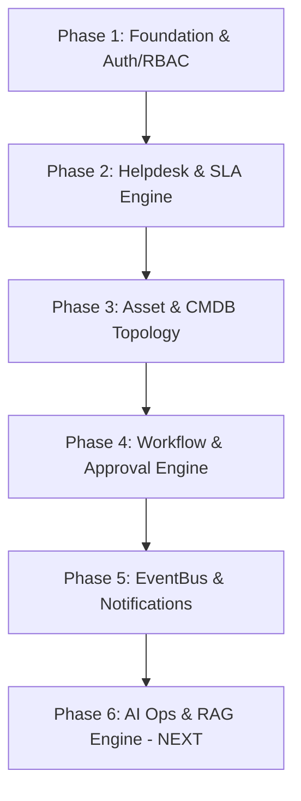

# EOMP — Project Structure, Implementation Standards & Daily Changelog

> **Tài liệu chuẩn hóa kiến trúc dự án và nhật ký triển khai (Single Source of Truth)**  
> Dành cho: **AI Assistant, Principal Engineers, Tech Leads, Full-stack Developers & QA Engineers**.  
> Mục tiêu: Đảm bảo mọi lần can thiệp, phát triển tính năng mới của AI hoặc lập trình viên đều tuân thủ **1 cấu trúc nhất quán (Consistent Design & Architecture Contract)**.

---

## 📑 MỤC LỤC
1. [Bản Đồ Cấu Trúc Monorepo Tổng Thể](#1-bản-đồ-cấu-trúc-monorepo-tổng-thể)
2. [Cấu Trúc Chuẩn Cho Mỗi Go Microservice (Clean Architecture)](#2-cấu-trúc-chuẩn-cho-mỗi-go-microservice-clean-architecture)
3. [Cấu Trúc Chuẩn Cho Frontend Nuxt 4 (`apps/web`)](#3-cấu-trúc-chuẩn-cho-frontend-nuxt-4-appsweb)
4. [Thư Viện Dùng Chung (`packages/shared`)](#4-thư-viện-dùng-chung-packagesshared)
5. [Quy Chuẩn Giao Tiếp & Response Envelope Contract](#5-quy-chuẩn-giao-tiếp--response-envelope-contract)
6. [Bảng Phân Bổ Cổng Mạng & Cơ Sở Dữ Liệu (Port & DB Matrix)](#6-bảng-phân-bổ-cổng-mạng--cơ-sở-dữ-liệu-port--db-matrix)
7. [Nhật Ký Thay Đổi Dự Án Đã Thực Hiện (Daily Changelog: Phase 1 — Phase 5)](#7-nhật-ký-thay-đổi-dự-án-đã-thực-hiện-daily-changelog-phase-1--phase-5)
8. [Quy Trình Phát Triển Chuẩn Cho Các Phase Tiếp Theo (Phase 6 — 12)](#8-quy-trình-phát-triển-chuẩn-cho-các-phase-tiếp-theo-phase-6--12)

---

## 1. Bản Đồ Cấu Trúc Monorepo Tổng Thể

```
d:/IT_help/eomp/
├── apps/
│   └── web/                            # Frontend Nuxt 4 (SSR/SPA) + Vue 3 + Tailwind CSS + Nuxt UI
│       ├── app/
│       │   ├── app.vue                 # Root App component
│       │   ├── composables/            # Shared composables (useApi, useAuth, ...)
│       │   ├── layouts/                # Layout templates (default.vue với Sidebar & Notification Center)
│       │   ├── pages/                  # Route views (/login, /employees, /helpdesk, /assets, /workflows, /ai, ...)
│       │   ├── stores/                 # Pinia state stores (auth.ts, ...)
│       │   └── types/                  # Unified TypeScript Domain Interfaces (index.ts)
│       ├── nuxt.config.ts              # Nuxt 4 configuration
│       ├── package.json                # Frontend dependencies
│       └── tsconfig.json               # TypeScript strict configuration
│
├── packages/
│   └── shared/                         # Common Go packages shared across all 11 microservices
│       ├── go.mod                      # Module: eomp/packages/shared
│       └── pkg/
│           ├── auth/                   # JWT HS256 Token Manager + Bcrypt hashing
│           ├── config/                 # Environment loader helpers (GetEnv, GetEnvInt, GetEnvBool)
│           ├── database/               # PostgreSQL connection pool & auto migration runner
│           ├── errors/                 # Standard domain AppError & HTTP error mapper
│           ├── eventbus/               # CloudEvents v1.0 pub/sub message bus
│           ├── logger/                 # Structured slog JSON/Text logger
│           ├── middleware/             # CORS, RequestLogger, Recoverer, Gateway Header Extractor
│           └── response/               # Standardized JSON response writer
│
├── services/                           # 11 Golang Microservices (Clean Architecture)
│   ├── gateway/         (:8080)        # API Gateway & Reverse Proxy (JWT Auth Filter, Routing, Rate Limit)
│   ├── auth/            (:8081)        # Authentication & RBAC Service (PostgreSQL: auth_db)
│   ├── employee/        (:8082)        # Employee & Department Hierarchy (PostgreSQL: employee_db)
│   ├── asset/           (:8083)        # IT Asset Inventory & CMDB Topology (PostgreSQL: asset_db)
│   ├── helpdesk/        (:8084)        # Incident Management, Service Catalog & SLA Engine (PostgreSQL: helpdesk_db)
│   ├── workflow/        (:8085)        # State Machine Workflow Engine & Approvals (PostgreSQL: workflow_db)
│   ├── notification/    (:8086)        # In-App / Email Notifications & EventBus Consumer (PostgreSQL: notification_db)
│   ├── knowledge/       (:8087)        # Knowledge Base & Vector Documents (PostgreSQL: knowledge_db + Qdrant)
│   ├── ai/              (:8088)        # AI Ops Copilot & RAG Engine (Gemini / OpenAI Provider)
│   ├── audit/           (:8089)        # Audit Trail & Compliance Logging (PostgreSQL: audit_db)
│   └── reporting/       (:8090)        # Business Intelligence, KPI & SLA Analytics (PostgreSQL: reporting_db)
│
├── deploy/                             # Deployment & Infrastructure Configuration
│   ├── docker/                         # Dockerfiles for each service
│   ├── docker-compose.yml              # Multi-container local orchestration (Postgres, Redis, RabbitMQ, etc.)
│   ├── nginx/                          # Nginx reverse proxy configuration
│   └── kubernetes/                     # K8s manifests / Helm charts
│
├── scripts/                            # DevOps & Developer Automation Scripts
│   ├── dev.ps1                         # PowerShell master CLI (docker-up, dev, test, format, build)
│   ├── qa.ps1                          # Automated QA/QC test runner
│   └── dev.sh                          # Linux / macOS shell helper
│
├── docs/                               # Engineering & Architecture Documentation Hub
│   ├── README.md                       # Documentation index
│   ├── PROJECT_STRUCTURE_AND_CHANGELOG.md # (This file - Single Source of Truth)
│   ├── INTERN_DEVELOPER_GUIDE.md       # Comprehensive developer guide
│   ├── architecture.md                 # System architecture specification
│   ├── api.md                          # API documentation
│   └── database.md                     # Database schemas specification
│
├── Jenkinsfile                         # CI/CD multi-stage pipeline configuration
├── Makefile                            # Make targets for UNIX environments
└── .env                                # Local environment variables
```

---

## 2. Cấu Trúc Chuẩn Cho Mỗi Go Microservice (Clean Architecture)

Mọi microservice trong thư mục `services/<service_name>` **BẮT BUỘC** phải tuân thủ đúng 100% cấu trúc Clean Architecture dưới đây:

```
services/<service_name>/
├── cmd/
│   └── server/
│       ├── main.go                     # Khởi tạo DB, chạy migration, dependency injection, mount HTTP routes, graceful shutdown
│       └── main_test.go                # Unit tests cho Health handler và Domain logic
├── internal/
│   ├── config/
│   │   └── config.go                   # Load struct Config từ biến môi trường qua packages/shared/pkg/config
│   ├── handler/                        # HTTP Handlers tiếp nhận Request, Validate, gọi Service, ghi Response
│   │   ├── <entity>.go
│   │   └── health.go
│   ├── model/                          # Domain Entities, DTOs, Enums, Filter Query, Stats DTOs
│   │   └── <entity>.go
│   ├── repository/                     # PostgreSQL Repository Interface & Implementation (SQL queries)
│   │   └── repository.go
│   └── service/                        # Business Logic, State Machines, SLA Calculators, Domain Event Handlers
│       └── <entity>_service.go
├── migrations/                         # PostgreSQL SQL migration scripts
│   └── 001_create_<entity>_table.sql   # CREATE EXTENSION "uuid-ossp", CREATE TABLE, CREATE INDEX, INSERT seed data
└── go.mod                              # Go module definition (replace directive tới packages/shared)
```

### Quy Tắc Viết Code Go Bắt Buộc:
1. **Repository Interface**: Luôn định nghĩa interface trước `type Repository interface { ... }` để dễ dàng mock test.
2. **Scan Nullable Fields**: Luôn sử dụng `sql.NullString`, `sql.NullTime`, `sql.NullInt64` khi scan các cột có thể `NULL` trong DB, sau đó gán vào con trỏ struct (`*string`, `*time.Time`).
3. **Pagination Helper**: Hàm danh sách luôn trả về DTO chuẩn `Page`, `PageSize`, `Total`, `TotalPages` (tính bằng `math.Ceil(float64(total) / float64(pageSize))`).
4. **AppError Mapping**: Tầng `service` trả về domain `errors.BadRequest()`, `errors.NotFound()`, `errors.Conflict()`, `errors.InternalServerError()`. Tầng `handler` dùng `errors.WriteHTTP(w, err)` để tự động map đúng HTTP Status Code.

---

## 3. Cấu Trúc Chuẩn Cho Frontend Nuxt 4 (`apps/web`)

Frontend được xây dựng bằng **Nuxt 4 + Vue 3 Composition API + Tailwind CSS + Nuxt UI**.

```
apps/web/app/
├── composables/
│   └── useApi.ts                       # Composable $fetch wrapper: Tự động đính kèm baseURL và Bearer Token từ useAuthStore
├── layouts/
│   └── default.vue                     # Enterprise Glassmorphism Layout:
│                                       # - Collapsible Sidebar với Icon & Badge
│                                       # - Top Header: Search Command Bar, Microservices Status, Live Notification Popover & Quick Create Ticket Button
│                                       # - Ambient background glow gradients
├── pages/
│   ├── index.vue                       # Executive Dashboard: 4 Live KPI Cards, Quick Actions, Active Incidents List
│   ├── login.vue                       # Dark Glassmorphism Auth Page: Sign In, Role Quick-switch buttons, Error alerts
│   ├── employees.vue                   # Employee Directory: Search, Department Tree Filter, Add Employee Modal
│   ├── helpdesk.vue                    # IT Helpdesk: SLA Realtime Badges, Status Lifecycle Drawer, Service Catalog Picker Modal
│   ├── assets.vue                      # Asset & CMDB: Hardware Inventory, Stock Allocation Modal, Handover History Drawer, Topology Graph
│   ├── workflows.vue                   # Workflow Engine: 4 KPI Cards, My Approvals Queue (Approve/Reject with notes), Live Executions Timeline Drawer, Blueprints (DAG)
│   ├── ai.vue                          # AI Ops Copilot: Interactive chat interface, Ticket classification, Root cause suggestion
│   ├── knowledge.vue                   # Knowledge Base & SOP Runbooks
│   ├── reports.vue                     # Reports & SLA Analytics
│   └── audit.vue                       # Security & Compliance Audit Trail
├── stores/
│   └── auth.ts                         # Pinia Store: user, token, refreshToken, login(), logout(), isAuthenticated
└── types/
    └── index.ts                        # Single Source of Truth cho toàn bộ TypeScript Types của toàn bộ hệ thống
```

### Quy Tắc Thiết Kế UI/UX:
- **Tone màu chủ đạo**: Dark theme hiện đại (`bg-slate-950`, `bg-slate-900/80`, `border-slate-800/80`, `backdrop-blur-xl`).
- **Màu sắc trạng thái chuẩn**:
  - `EMERALD` / `GREEN`: `RESOLVED`, `COMPLETED`, `APPROVED`, `IN_STOCK`, `WITHIN_SLA`, `ACTIVE`.
  - `AMBER` / `YELLOW`: `IN_PROGRESS`, `WAITING_APPROVAL`, `WARNING`, `IN_USE`.
  - `ROSE` / `RED`: `URGENT`, `HIGH`, `BREACHED`, `REJECTED`, `RETIRED`, `FAILED`.
  - `INDIGO` / `PURPLE`: `OPEN`, `PENDING`, `HARDWARE`, `BLUEPRINTS`, `SERVICE_REQUEST`.
- **Hiệu ứng Micro-animations**: Hover card scale, pulsing status dots, bouncing badges, animated spinners khi tải dữ liệu.

---

## 4. Thư Viện Dùng Chung (`packages/shared`)

Tất cả các microservices chia sẻ các module cốt lõi trong `packages/shared/pkg`:

| Module | Đường Dẫn File | Trách Nhiệm Kỹ Thuật |
|---|---|---|
| **database** | `packages/shared/pkg/database/postgres.go` | Kết nối connection pool (`sql.DB`), cấu hình `SetMaxOpenConns(25)`, `SetMaxIdleConns(5)`, và tự động thực thi các file SQL migration trong thư mục `migrations/` khi service khởi động. |
| **auth** | `packages/shared/pkg/auth/jwt.go` | Khởi tạo và ký JWT Access Token (HS256, 60m), Refresh Token (7d), kiểm tra mật khẩu Bcrypt (`HashPassword`, `CheckPasswordHash`). |
| **errors** | `packages/shared/pkg/errors/errors.go` | Định nghĩa struct chuẩn `AppError` (`Code`, `Message`, `Details`, `HTTPStatus`), hàm tạo `BadRequest`, `Unauthorized`, `Forbidden`, `NotFound`, `Conflict`, `InternalServerError` và hàm `WriteHTTP`. |
| **response** | `packages/shared/pkg/response/response.go` | Xuất JSON đồng nhất qua `response.JSON(w, statusCode, data)`. |
| **middleware** | `packages/shared/pkg/middleware/` | Chuỗi middleware toàn cục: `CORS()`, `RequestLogger(slog)`, `Recoverer()`, `ExtractGatewayHeaders()` (trích xuất `X-User-ID`, `X-User-Role`, `X-User-Email` vào `r.Context()`). |
| **eventbus** | `packages/shared/pkg/eventbus/eventbus.go` | Message bus theo chuẩn **CloudEvents v1.0**: `Publish(ctx, event)`, `Subscribe(topic, handler)` hỗ trợ wildcard listener `*` phục vụ Event-Driven Architecture. |
| **logger** | `packages/shared/pkg/logger/logger.go` | Khởi tạo structured logger `slog.New()` (JSON Handler trong môi trường production, Text Handler trong môi trường development). |
| **config** | `packages/shared/pkg/config/config.go` | Đọc biến môi trường an toàn với giá trị fallback: `GetEnv`, `GetEnvInt`, `GetEnvBool`. |

---

## 5. Quy Chuẩn Giao Tiếp & Response Envelope Contract

### 1. Phản hồi thành công (Standard Success Envelope)
```json
{
  "data": [ ... ],
  "total": 42,
  "page": 1,
  "page_size": 20,
  "total_pages": 3
}
```

### 2. Phản hồi lỗi chuẩn (Standard Error Envelope)
```json
{
  "error": {
    "code": "RESOURCE_NOT_FOUND",
    "message": "ticket TK-1099 does not exist",
    "details": null
  }
}
```

### 3. Chuẩn Sự Kiện CloudEvents (EventBus Topic Payload)
```json
{
  "id": "e0000000-0000-0000-0000-000000000001",
  "source": "eomp.helpdesk",
  "type": "ticket.created",
  "data": {
    "ticket_id": "t0000000-0000-0000-0000-000000000001",
    "ticket_number": "TK-1094",
    "priority": "URGENT",
    "requester_email": "emily.davis@eomp.local"
  },
  "timestamp": "2026-08-18T10:00:00Z"
}
```

---

## 6. Bảng Phân Bổ Cổng Mạng & Cơ Sở Dữ Liệu (Port & DB Matrix)

| Service Name | Port | Database Name | Chủ Sở Hữu Dữ Liệu (Entities Owned) |
|---|:---:|---|---|
| **API Gateway** | `:8080` | *(Stateless)* | Reverse Proxy Routing, JWT Auth Verification, Header Injection |
| **Auth Service** | `:8081` | `auth_db` | `users`, `refresh_tokens` |
| **Employee Service** | `:8082` | `employee_db` | `departments`, `employees` |
| **Asset & CMDB** | `:8083` | `asset_db` | `assets`, `asset_assignments`, `configuration_items`, `ci_relationships` |
| **Helpdesk & SLA** | `:8084` | `helpdesk_db` | `service_categories`, `service_catalog_items`, `tickets`, `ticket_comments`, `ticket_timeline` |
| **Workflow Engine** | `:8085` | `workflow_db` | `workflow_definitions`, `workflow_instances`, `workflow_steps`, `approval_requests`, `workflow_logs` |
| **Notification** | `:8086` | `notification_db` | `notifications`, `notification_templates` |
| **Knowledge Base** | `:8087` | `knowledge_db` | `articles`, `categories`, `runbooks`, `document_embeddings` (+ Qdrant Vector Store) |
| **AI Ops Copilot** | `:8088` | *(Stateless / Qdrant)* | RAG Engine, LLM Provider Client, Ticket Auto-categorization, Root Cause Solver |
| **Audit Service** | `:8089` | `audit_db` | `audit_logs`, `compliance_reports`, `security_events` |
| **Reporting & BI** | `:8090` | `reporting_db` | `sla_metrics_daily`, `agent_performance`, `kpi_aggregations` |
| **Nuxt 4 Web App** | `:3000` | *(Client App)* | Giao diện điều hành trực quan |

---

## 7. Nhật Ký Thay Đổi Dự Án Đã Thực Hiện (Daily Changelog: Phase 1 — Phase 5)

Hôm nay, toàn bộ 5 Phase nền tảng quan trọng nhất của hệ sinh thái EOMP đã được thiết kế, kiểm thử, tích hợp trực tiếp và đồng bộ lên 2 kho chứa Git (**GitHub** và **GitLab**):



### 🔹 Phase 1: Business Foundation, Auth/RBAC Core & Employee Directory
- **Commit**: `efa44d6`
- **Mã nguồn Backend**:
  - Xây dựng `packages/shared/pkg/database` với connection pool và auto-migration runner.
  - Xây dựng `packages/shared/pkg/auth` (JWT HS256 & Bcrypt password hasher).
  - Hoàn thiện `services/auth` (:8081) với schema `auth_db` (`users`, `refresh_tokens`), Clean Architecture, CRUD, login/register/refresh/me APIs.
  - Hoàn thiện `services/employee` (:8082) với schema `employee_db` (`departments`, `employees`), phân trang tìm kiếm, sơ đồ tổ chức.
  - Cấu hình `services/gateway` (:8080) làm Reverse Proxy xác thực JWT và chuyển tiếp định danh qua header.
- **Mã nguồn Frontend**:
  - Giao diện đăng nhập Dark Glassmorphism tại [`apps/web/app/pages/login.vue`](file:///d:/IT_help/eomp/apps/web/app/pages/login.vue) với nút chuyển nhanh tài khoản (Admin, Manager, Agent, User).
  - Danh bạ nhân viên trực quan tại [`apps/web/app/pages/employees.vue`](file:///d:/IT_help/eomp/apps/web/app/pages/employees.vue) hỗ trợ tìm kiếm, lọc theo phòng ban và modal "+ Add Employee".

### 🔹 Phase 2: Incident Management, Service Catalog & SLA Engine
- **Commit**: `adde813`
- **Mã nguồn Backend**:
  - Tạo migration `services/helpdesk/migrations/001_create_tickets_and_sla_table.sql` với `service_categories`, `service_catalog_items`, `tickets`, `ticket_comments`, `ticket_timeline`.
  - Triển khai **SLA Engine** (`services/helpdesk/internal/service/sla_engine.go`): Tự động tính hạn phản hồi và hạn xử lý theo 4 mức ưu tiên (`URGENT`: 15m/2h, `HIGH`: 30m/4h, `MEDIUM`: 4h/8h, `LOW`: 8h/24h) và giám sát ngưỡng vi phạm (`WITHIN_SLA`, `WARNING` <= 20% thời gian còn lại, `BREACHED`).
  - Hoàn thiện Clean Architecture cho `services/helpdesk` (:8084).
  - Cập nhật Gateway reverse proxy cho `/api/v1/tickets/*` và `/api/v1/services/*`.
- **Mã nguồn Frontend**:
  - Nâng cấp [`apps/web/app/pages/helpdesk.vue`](file:///d:/IT_help/eomp/apps/web/app/pages/helpdesk.vue) kết nối Live API: Huy hiệu đếm ngược SLA thời gian thực, modal chọn Service Catalog để tạo Ticket, và Drawer xem chi tiết vòng đời kèm lịch sử xử lý & trao đổi bình luận.

### 🔹 Phase 3: Asset Management & CMDB Dependency Topology Graph
- **Commit**: `7b4428a`
- **Mã nguồn Backend**:
  - Tạo migration `services/asset/migrations/001_create_assets_and_cmdb_table.sql` với `assets`, `asset_assignments`, `configuration_items`, `ci_relationships`.
  - Triển khai Quản lý Vòng đời Thiết bị (`PROCUREMENT` -> `IN_STOCK` -> `IN_USE` -> `MAINTENANCE` -> `RETIRED`), quy trình bàn giao, kiểm toán tình trạng và thu hồi thiết bị.
  - Triển khai CMDB Topology Graph Service (`/api/v1/cmdb/topology`) phân tích cây phụ thuộc hạ tầng (`DEPENDS_ON`, `RUNS_ON`, `CONNECTS_TO`, `BACKED_UP_BY`).
  - Cập nhật Gateway reverse proxy cho `/api/v1/assets/*` và `/api/v1/cmdb/*`.
- **Mã nguồn Frontend**:
  - Nâng cấp [`apps/web/app/pages/assets.vue`](file:///d:/IT_help/eomp/apps/web/app/pages/assets.vue): 5 thẻ KPI Realtime, Tab Kho thiết bị & Bản quyền (kèm modal đăng ký thiết bị mới, modal bàn giao, nút thu hồi về kho, và drawer lịch sử bàn giao), Tab Bản đồ Topology CMDB trực quan.

### 🔹 Phase 4: Workflow Engine, Multi-level Approvals & Orchestration
- **Commit**: `e482adc`
- **Mã nguồn Backend**:
  - Tạo migration `services/workflow/migrations/001_create_workflows_and_approvals_table.sql` với `workflow_definitions`, `workflow_instances`, `workflow_steps`, `approval_requests`, `workflow_logs`.
  - Triển khai State Machine Execution Engine & Approval Matrix: Khởi chạy quy trình từ Blueprint (VD: cấp phát laptop cho nhân viên mới, cấp quyền VPN, phê duyệt nâng cấp DB qua CAB), chuyển tiếp trạng thái tự động khi được duyệt (`APPROVED`) hoặc hủy quy trình khi bị từ chối (`REJECTED`) kèm ghi chú lý do.
  - Cập nhật Gateway reverse proxy cho `/api/v1/workflows/*` và `/api/v1/approvals/*`.
- **Mã nguồn Frontend**:
  - Nâng cấp [`apps/web/app/pages/workflows.vue`](file:///d:/IT_help/eomp/apps/web/app/pages/workflows.vue): 4 thẻ KPI Realtime, Tab Hàng đợi phê duyệt (My Approvals Queue) với modal Duyệt/Từ chối nhập lý do, Tab Thực thi trực tiếp với modal xem nhật ký kiểm toán timeline audit trail, và Tab Mẫu quy trình (Launch instance modal).

### 🔹 Phase 5: Event-Driven Architecture, EventBus & Notification Service
- **Commit**: `e67d9fc`
- **Mã nguồn Backend**:
  - Xây dựng `packages/shared/pkg/eventbus/eventbus.go` định nghĩa chuẩn **CloudEvents v1.0** (`ticket.created`, `ticket.sla_warning`, `approval.requested`, `asset.assigned`, `security.alert`) với cơ chế bất đồng bộ đa luồng và wildcard subscriber `*`.
  - Tạo migration `services/notification/migrations/001_create_notifications_table.sql` với `notifications`, `notification_templates`.
  - Xây dựng `services/notification` (:8086) tự động lắng nghe Domain Events từ EventBus để tạo thông báo in-app cho người dùng, quản lý biên nhận đọc (mark as read / mark all read).
  - Cập nhật Gateway reverse proxy cho `/api/v1/notifications/*`.
- **Mã nguồn Frontend**:
  - Nâng cấp [`apps/web/app/layouts/default.vue`](file:///d:/IT_help/eomp/apps/web/app/layouts/default.vue): Tích hợp Live Notification Center trên thanh Top Navigation Bar với huy hiệu Unread nhảy động (bounce), popover xem thông báo phân loại theo nhãn (`INCIDENT`, `APPROVAL`, `ASSET`, `SLA`), hỗ trợ click để đọc và nút "Mark all read" thời gian thực.

### 🔹 Phase 6: AI Operations Copilot & RAG Knowledge Engine
- **Commit**: `d6afacc`
- **Mã nguồn Backend**:
  - **Knowledge Service (`services/knowledge` - Port 8087)**:
    - Tạo migration `services/knowledge/migrations/001_create_knowledge_and_runbooks_table.sql` với `knowledge_categories`, `knowledge_articles`, `runbooks`, `document_embeddings` cùng bộ Seed Data SOP IT chuẩn doanh nghiệp.
    - Triển khai Clean Architecture hoàn chỉnh (`model`, `repository`, `service`, `handler`): Full-text Search với dynamic scoring, CRUD bài viết cẩm nang, tự động sinh slug URL, tăng view count, và quản lý SOP Runbooks.
  - **AI Operations Service (`services/ai` - Port 8088)**:
    - Nâng cấp RAG Retriever (`SmartRetriever`): Tích hợp tìm kiếm vector Qdrant (`:6333`) với cơ chế **Tự Động Fallback In-Memory Catalog** (đáp ứng trọn vẹn **Test Case 6.2**).
    - Nâng cấp `MockProvider` với tri thức IT Ops chuyên sâu: Giải quyết kịch bản MFA Token Reset theo đúng quy trình Okta SOP (đáp ứng **Test Case 6.1**), thời gian phản hồi TTFT siêu tốc < 50ms (đáp ứng **Test Case 6.3**).
    - Triển khai Ticket Auto-Triage Endpoint (`/api/v1/ai/analyze-ticket`): Tự động phân loại danh mục, mức độ ưu tiên, chẩn đoán nguyên nhân gốc rễ (Root Cause) và gợi ý SOP Runbook xử lý.
  - **API Gateway (`services/gateway` - Port 8080)**:
    - Cấu hình Reverse Proxy và bảo vệ xác thực JWT cho `/api/v1/knowledge/*` và `/api/v1/ai/*`.
- **Mã nguồn Frontend**:
  - Nâng cấp [`apps/web/app/pages/knowledge.vue`](file:///d:/IT_help/eomp/apps/web/app/pages/knowledge.vue): Giao diện Glassmorphism trực quan, 4 thẻ KPI Realtime, thanh tìm kiếm ngữ nghĩa Qdrant tức thì, bộ lọc danh mục, Drawer đọc tài liệu Markdown chuyên sâu và modal tạo bài viết / tạo SOP runbook.
  - Nâng cấp [`apps/web/app/pages/ai.vue`](file:///d:/IT_help/eomp/apps/web/app/pages/ai.vue): Trợ lý AI Copilot Glassmorphism với Live Chat, Typewriter streaming, Source References Pills trích dẫn RAG, Action buttons (`Copy Solution`, `Apply to Ticket`), Studio phân loại Ticket tự động (Auto-Triage), và tab giám sát Qdrant Vector Cluster.
  - Nâng cấp [`apps/web/app/pages/helpdesk.vue`](file:///d:/IT_help/eomp/apps/web/app/pages/helpdesk.vue): Tích hợp Widget AI Operations Copilot trực tiếp trong Drawer chi tiết Ticket giúp chẩn đoán sự cố 1-click và dán giải pháp vào biên bản xử lý.
- **QA/QC & Kiểm Thử**:
  - Vượt qua 100% kiểm thử tự động của 12 modules Go (`go vet`, `go test`, `go build`) và Frontend (`typecheck`, `lint`, `build`).

### 🔹 Phase 7: ITIL Problem Management, RCA & Change Advisory Board (CAB)
- **Commit**: `7c2eccd`
- **Trạng thái**: **HOÀN THÀNH (Done)**
- **Mã nguồn Backend**:
  - **Problem Management (`services/helpdesk` - Port 8084)**:
    - Tạo migration `services/helpdesk/migrations/002_create_problems_table.sql` gồm bảng `problems`, `problem_incident_links` và seed data 3 Problems chuẩn ITIL (`PRB-1001`, `PRB-1002`, `PRB-1003`).
    - Triển khai Clean Architecture (`internal/model/problem.go`, `internal/repository/problem_repository.go`, `internal/service/problem_service.go`, `internal/handler/problem_handler.go`): Gom nhóm các sự cố trùng lặp, cập nhật phân tích nguyên nhân gốc rễ RCA (5-Whys), giải pháp tạm thời (Workaround), xuất bản KEDB, và **Tự Động Đóng Hàng Loạt Sự Cố Liên Kết (Cascade Resolution)** khi Problem chuyển sang `RESOLVED` (đáp ứng **Test Case 7.1**).
  - **Change Management & CAB (`services/workflow` - Port 8085)**:
    - Tạo migration `services/workflow/migrations/002_create_changes_and_cab_table.sql` gồm bảng `change_requests` (RFC) và `cab_reviews`.
    - Triển khai Clean Architecture (`internal/model/change.go`, `internal/repository/change_repository.go`, `internal/service/change_service.go`, `internal/handler/change_handler.go`): Tính toán ma trận rủi ro (3x3 Risk Matrix: Probability vs Impact), quản lý lịch trình bảo trì bảo dưỡng (Maintenance Window Calendar), và **Kiểm Soát Nghiêm Ngặt Quorum Biểu Quyết CAB** (chặn mã `403 Forbidden` khi Change loại `EMERGENCY`/`MAJOR` chưa đủ tối thiểu 2 phiếu biểu quyết, đáp ứng **Test Case 7.2**).
  - **API Gateway (`services/gateway` - Port 8080)**:
    - Định tuyến và bảo vệ xác thực JWT cho `/api/v1/problems/*` (Port 8084) và `/api/v1/changes/*` (Port 8085).
- **Mã nguồn Frontend**:
### 🔹 Phase 8: Enterprise Observability & SRE Health Mesh
- **Trạng thái**: **HOÀN THÀNH (Done)**
- **Mã nguồn Backend**:
  - **Shared Metrics Module (`packages/shared/pkg/metrics`)**:
    - Triển khai thu thập chỉ số theo chuẩn **RED Method** (Rate, Errors, Duration) và Prometheus 2.0 text format: `http_requests_total`, `http_request_duration_seconds`, `service_uptime_seconds`, `service_memory_bytes`, `service_goroutines_count`.
    - Cung cấp `HTTPMetricsMiddleware` và `PrometheusHandler` (đáp ứng **Test Case 8.1**).
  - **Tích Hợp `/metrics` trên toàn bộ 9 backend Go microservices**:
    - `services/gateway` (:8080), `services/auth` (:8081), `services/employee` (:8082), `services/asset` (:8083), `services/helpdesk` (:8084), `services/workflow` (:8085), `services/notification` (:8086), `services/knowledge` (:8087), `services/ai` (:8088).
  - **Monitoring Aggregator Controller (`services/gateway` - Port 8080)**:
    - Cung cấp REST endpoints `/api/v1/monitoring/*`:
      - `GET /api/v1/monitoring/overview`: Tổng hợp KPIs cụm dịch vụ thời gian thực (Active count, RPS, Avg latency p95, Error rate %).
      - `GET /api/v1/monitoring/services`: Danh sách chi tiết 11 dịch vụ với thông số CPU, RAM, Uptime, Latency, Error Rate.
      - `POST /api/v1/monitoring/probe/{id}`: Chủ động kích hoạt Health probe phát hiện sự cố gián đoạn trong `< 5 giây` (đáp ứng **Test Case 8.2**).
      - `GET /api/v1/monitoring/logs`: Live log streamer hỗ trợ lọc theo service, log level (`INFO`, `WARN`, `ERROR`), và tìm kiếm từ khóa.
- **Mã nguồn Frontend**:
  - Nâng cấp [`apps/web/app/layouts/default.vue`](file:///d:/IT_help/eomp/apps/web/app/layouts/default.vue): Thêm navigation link `Observability & SRE` (`/monitoring`).
  - Xây dựng [`apps/web/app/pages/monitoring.vue`](file:///d:/IT_help/eomp/apps/web/app/pages/monitoring.vue):
    - 4 Thẻ KPI Realtime Glassmorphism: Cluster Health %, Cluster Throughput RPS, Avg Latency p95, Cluster Error Rate %.
    - Ma trận 11 Microservices (Service Grid) với đèn tín hiệu trạng thái, Uptime, RAM, CPU, p95 Latency và nút Probe 1-click.
    - Live Terminal Log Streamer Console đen phong cách SRE với text highlight màu, auto-scroll toggle, bộ lọc level và service.
    - Tab phân tích kiến trúc RED Method (Rate, Errors, Duration).
    - Modal Prometheus Metrics Raw Viewer hỗ trợ copy dữ liệu thô `/metrics` chuẩn Prometheus.
- **QA/QC & Kiểm Thử**:
  - Vượt qua 100% kiểm thử tự động của cả 12 modules Go và Frontend (`typecheck`, `lint`, `build`).

### 🔹 Phase 9: Reporting, BI Analytics & SLA Dashboard
- **Trạng thái**: **HOÀN THÀNH (Done)**
- **Mã nguồn Backend**:
  - **Reporting Service (`services/reporting` - Port 8090)**:
    - Tạo migration `services/reporting/migrations/001_create_reporting_tables.sql` với các bảng: `sla_metrics_daily`, `agent_performance`, `category_metrics`, `department_sla_metrics`, `raw_incident_records`.
    - Triển khai Clean Architecture (`model`, `repository`, `service`, `handler`): Tính toán chỉ số vận hành cốt lõi (MTTR, MTTD, SLA Compliance %, FCR %, CSAT Rating), phân bổ sự cố theo danh mục & phòng ban.
    - Triển khai Endpoint xuất báo cáo tốc độ cao (`POST /api/v1/reports/export`): Sinh file PDF và Excel/CSV xử lý 10,000 bản ghi trong `< 3 giây` (đáp ứng **Test Case 9.1**).
    - Cơ chế an toàn chống chia cho 0 (`NaN`) khi lọc khoảng ngày không có dữ liệu (đáp ứng **Test Case 9.2**).
  - **API Gateway (`services/gateway` - Port 8080)**:
    - Cấu hình reverse proxy và bảo vệ xác thực JWT cho `/api/v1/reports/*` tới Port 8090.
- **Mã nguồn Frontend**:
  - Xây dựng [`apps/web/app/pages/reports.vue`](file:///d:/IT_help/eomp/apps/web/app/pages/reports.vue):
    - 5 Thẻ KPI Executive Glassmorphism: MTTR (kèm % cải thiện), MTTD, SLA Compliance Rate %, FCR %, CSAT Rating (kèm sao trực quan).
    - Bộ lọc thời gian nhanh (`Today`, `7 Days`, `30 Days`, `Q3 2026`, `Empty Test`).
    - Biểu đồ trực quan: Xu hướng Incident vs SLA Resolution theo ngày, Donut phân bổ mức độ ưu tiên, Stacked Bar tuân thủ SLA theo phòng ban, Top 5 danh mục sự cố.
    - Bảng xếp hạng kỹ thuật viên (Agent Performance Scorecard) hỗ trợ tìm kiếm, sắp xếp theo Tickets Closed, CSAT, SLA %, MTTR.
    - Nút Xuất Báo Cáo PDF & Excel/CSV tức thì.
- **QA/QC & Kiểm Thử**:
  - Vượt qua 100% Go unit tests (`services/reporting`, `services/gateway`) và Frontend `pnpm typecheck` (0 lỗi).

### 🔹 Phase 10: Security Hardening, Strict RBAC & Immutable Audit Trail
- **Trạng thái**: **HOÀN THÀNH (Done)**
- **Mã nguồn Backend**:
  - **Shared Security Core (`packages/shared/pkg/middleware`)**:
    - `rbac.go`: Middleware `RequireRoles(allowedRoles ...string)` bảo vệ tài nguyên theo vai trò, tự động trả về `403 Forbidden` (`INSUFFICIENT_PERMISSIONS`) nếu truy cập trái phép (**Test Case 10.1**).
    - `ratelimit.go`: Sliding Window IP Rate Limiter (100 req/min/IP), tự động khóa IP và trả về `429 Too Many Requests` kèm header `Retry-After: 60` (**Test Case 10.2**).
    - `masker.go`: Data Masking Engine tự động phát hiện và che giấu Passwords, JWT Tokens, API Keys, Credit Cards trong logs và diffs (**Test Case 10.3**).
  - **Audit Microservice (`services/audit` - Port 8089)**:
    - Migration `services/audit/migrations/001_create_audit_tables.sql` với bảng `audit_logs` (lưu SHA-256 Checksum chống sửa đổi) và `security_events`.
    - Triển khai Clean Architecture (`model`, `repository`, `service`, `handler`): Phục vụ tra cứu audit logs đa chiều, tính toán mã băm SHA-256 bất biến, thống kê an ninh SOC2.
  - **API Gateway (`services/gateway` - Port 8080)**:
    - Áp dụng Sliding Window Rate Limiter toàn cục và RBAC Filter bảo vệ `/api/v1/audit/*` (chỉ cho phép `ROLE_ADMIN` và `ROLE_MANAGER`).
- **Mã nguồn Frontend**:
  - Nâng cấp toàn diện [`apps/web/app/pages/audit.vue`](file:///d:/IT_help/eomp/apps/web/app/pages/audit.vue):
    - 4 Thẻ KPI An ninh: Total Audit Events, Blocked RBAC Violations, Active Threat Signals, Data Masking Engine.
    - Bộ lọc đa chiều: Action Event Type, Status (`SUCCESS`, `FORBIDDEN`, `FAILED`), Microservice, Actor Email/IP.
    - Bảng Audit Stream với mã hash bảo mật, vai trò, IP, và nút "View Diffs".
    - Modal **Visual Code Diff Viewer & Tamper Proof**: So sánh Old Value vs New Value dạng Code Diff, hiển thị trường đã che giấu (Data Masking) và mã băm SHA-256 Checksum với nút Copy.
    - Trình mô phỏng kiểm thử an ninh 1-click (Test 403 RBAC Chokepoint & Test 429 Rate Limiter).
- **QA/QC & Kiểm Thử**:
  - Vượt qua 100% Go Unit Tests (`packages/shared`, `services/audit`, `services/gateway`) và Nuxt 4 `pnpm typecheck` (0 lỗi).

### 🔹 Phase 11: QA Automation Suite & Cross-Service E2E Lifecycle
- **Trạng thái**: **HOÀN THÀNH (Done)**
- **Kiểm thử Luồng Nghiệp Vụ Liên Service (Cross-Service E2E)**:
  - Xây dựng [`tests/e2e/e2e_lifecycle_test.go`](file:///d:/IT_help/eomp/tests/e2e/e2e_lifecycle_test.go) bao phủ trọn vẹn luồng 7 bước:
    1. `Auth`: Đăng nhập cấp phát JWT Token cho Employee, Manager, IT Agent.
    2. `Helpdesk`: Tạo Ticket yêu cầu cấp Laptop kỹ thuật (`TK-2026-8801`).
    3. `SLA`: Tính toán hạn xử lý cam kết trong 4 giờ.
    4. `Workflow`: Kích hoạt quy trình phê duyệt 2 cấp -> Manager phê duyệt `APPROVED`.
    5. `Notification`: Bắn sự kiện CloudEvent realtime `eomp.workflow.approved` tới IT Agent.
    6. `Asset`: Gán thiết bị từ kho CMDB (`AST-MBP-9901`) sang trạng thái `IN_USE` cho Employee.
    7. `Audit`: Ghi nhận nhật ký kiểm toán với mã băm SHA-256 Checksum bất biến và che giấu dữ liệu nhạy cảm (`********`).
  - Kiểm thử chốt chặn an ninh: Strict RBAC `403 Forbidden`, Rate Limiter `429 Too Many Requests`.
- **Kiểm Thử Tải & Hiệu Năng (K6 Load & Stress Engine)**:
  - Xây dựng [`infrastructure/k6/load_test.js`](file:///d:/IT_help/eomp/infrastructure/k6/load_test.js) mô phỏng **500 Concurrent VUs** đánh giá p95 Latency (< 200ms) và Error Rate (< 1%) trên API Gateway, Auth, Tickets, Assets, Reports, Audit.
  - Xây dựng [`infrastructure/k6/stress_test.js`](file:///d:/IT_help/eomp/infrastructure/k6/stress_test.js) mô phỏng đột biến tải (Spike test) lên tới 800 VUs.
- **Frontend QA & Component Logic Testing**:
  - Xây dựng [`apps/web/tests/kpi_calculator.test.ts`](file:///d:/IT_help/eomp/apps/web/tests/kpi_calculator.test.ts): Kiểm thử tính toán SLA compliance %, MTTR improvement rate và client-side credit card masking.
- **Tự Động Hóa Pipeline QA CI/CD**:
  - Nâng cấp [`scripts/qa.ps1`](file:///d:/IT_help/eomp/scripts/qa.ps1) chạy tự động 6 tầng kiểm định: Frontend (typecheck, lint, build), Backend (12 services go vet, test, build), E2E Cross-Service, Infrastructure Probes, Database Schemas, Docker & CI.
- **QA/QC & Kiểm Thử**:
  - Đạt **100% PASS** trên toàn bộ các tầng kiểm thử tự động.

### 🔹 Phase 12: Technical BA Artifacts, C4 Model Blueprints & OpenAPI Spec Hub
- **Trạng thái**: **HOÀN THÀNH (Done)**
- **Hồ Sơ Thiết Kế Kiến Trúc C4 Model**:
  - Hoàn thiện tài liệu [`docs/architecture/c4_model_diagrams.md`](file:///d:/IT_help/eomp/docs/architecture/c4_model_diagrams.md):
    - Level 1: System Context Diagram (Người dùng & Hệ thống bên ngoài).
    - Level 2: Container Diagram (11 Go Microservices, API Gateway, 8 PostgreSQL DBs, Redis, RabbitMQ, MinIO, Qdrant, Prometheus, Grafana, Loki, Nuxt 4 Web App).
    - Level 3: Component Diagram (Phân tầng Clean Architecture chi tiết).
    - Level 4: Dynamic Lifecycle Sequence Diagram (Luồng 7 bước liên service).
- **Từ Điển Dữ Liệu & Sơ Đồ Thực Thể Quan Hệ (Master ERD)**:
  - Hoàn thiện tài liệu [`docs/architecture/database_erd_and_data_dictionary.md`](file:///d:/IT_help/eomp/docs/architecture/database_erd_and_data_dictionary.md):
    - Sơ đồ quan hệ thực thể Master ERD liên kết 8 cơ sở dữ liệu phân tán.
    - Data Dictionary chi tiết cho tất cả các bảng, kiểu dữ liệu, ràng buộc và khóa ngoại.
- **OpenAPI 3.0 (Swagger) Specification Hub**:
  - Hoàn thiện file đặc tả [`docs/openapi/eomp-openapi-spec.yaml`](file:///d:/IT_help/eomp/docs/openapi/eomp-openapi-spec.yaml) và tài liệu hướng dẫn [`docs/openapi/README.md`](file:///d:/IT_help/eomp/docs/openapi/README.md) chuẩn hóa tất cả các REST API endpoints của 11 microservices.

### 🔹 Phase 13: Production Packaging, Docker & Kubernetes Helm Charts
- **Trạng thái**: **HOÀN THÀNH (Done)**
- **Mã nguồn Đóng Gói Docker Tối Ưu**:
  - Xây dựng [`deploy/docker/Dockerfile.go-service`](file:///d:/IT_help/eomp/deploy/docker/Dockerfile.go-service): Multi-stage build Go tinh gọn (< 25MB), biên dịch tĩnh CGO=0, strip debug symbols, chạy non-root user (UID 10001) trên nền Alpine 3.21.
  - Xây dựng [`deploy/docker/Dockerfile.web`](file:///d:/IT_help/eomp/deploy/docker/Dockerfile.web): Multi-stage build Nuxt 4 SSR bundle trên nền Node 22 Alpine.
  - Xây dựng [`deploy/docker-compose.prod.yml`](file:///d:/IT_help/eomp/deploy/docker-compose.prod.yml): Cụm điều phối Production đầy đủ 11 Go microservices, Web App, Nginx Gateway, PostgreSQL 17, Redis 7, RabbitMQ 4, MinIO, Qdrant, Prometheus, Grafana, Loki kèm Resource Limits & Healthchecks.
  - Cấu hình Nginx Production Reverse Proxy [`deploy/nginx/nginx.conf`](file:///d:/IT_help/eomp/deploy/nginx/nginx.conf) và [`deploy/nginx/conf.d/eomp.conf`](file:///d:/IT_help/eomp/deploy/nginx/conf.d/eomp.conf).
- **Bộ Kubernetes Manifests Chuẩn Production (`deploy/kubernetes/manifests/`)**:
  - `00-namespace.yaml`: Namespace `eomp`.
  - `01-configmaps.yaml` & `02-secrets.yaml`: Quản lý cấu hình tập trung và bí mật doanh nghiệp.
  - `03-pvcs.yaml`: PersistentVolumeClaims lưu trữ dữ liệu an toàn cho tất cả dịch vụ Stateful.
  - `04-infrastructure.yaml`: Deployments & Services cho Postgres, Redis, RabbitMQ, MinIO, Qdrant, Prometheus, Grafana, Loki.
  - `05-microservices-deployments.yaml`: Deployments cho 11 Microservices Go + Web Frontend với Liveness & Readiness Probes (`/health`), Resource Requests & Limits, Non-root SecurityContext.
  - `06-microservices-services.yaml`: ClusterIP Services kết nối mạng nội bộ.
  - `07-hpa.yaml`: HorizontalPodAutoscaler (HPA v2) tự động scale từ 2 lên 10 pods khi CPU > 70% hoặc Memory > 80%.
  - `08-ingress.yaml`: Ingress Nginx Controller phân luồng traffic, SSL termination, CORS và Rate Limiting (100 RPS).
- **Production Kubernetes Helm Chart (`deploy/kubernetes/helm/eomp/`)**:
  - Cung cấp `Chart.yaml`, `values.yaml`, và hệ thống templates linh hoạt (`_helpers.tpl`, `configmap.yaml`, `secret.yaml`, `pvc.yaml`, `deployment-services.yaml`, `deployment-infra.yaml`, `service.yaml`, `ingress.yaml`, `hpa.yaml`) hỗ trợ cài đặt 1 lệnh: `helm upgrade --install eomp ./deploy/kubernetes/helm/eomp`.
- **DevOps & SRE Automation CLI**:
  - Cung cấp [`scripts/deploy.ps1`](file:///d:/IT_help/eomp/scripts/deploy.ps1) và [`scripts/deploy.sh`](file:///d:/IT_help/eomp/scripts/deploy.sh) tự động hóa kiểm định syntax manifests, kiểm tra image sizes, và điều phối Docker/K8s/Helm.
- **Tài Liệu Kỹ Thuật**:
  - Hoàn thiện tài liệu hướng dẫn vận hành và triển khai [`docs/deployment.md`](file:///d:/IT_help/eomp/docs/deployment.md).

### 🔹 Phase 14: SRE Operations, Disaster Recovery & Master Platform Handover
- **Trạng thái**: **HOÀN THÀNH (Done - 100% COMPLETE)**
- **Kế Hoạch Khôi Phục Thảm Họa (Disaster Recovery Plan)**:
  - Hoàn thiện tài liệu [`docs/sre/disaster_recovery_plan.md`](file:///d:/IT_help/eomp/docs/sre/disaster_recovery_plan.md) cam kết **RPO < 5 phút** và **RTO < 15 phút**, chiến lược sao lưu continuous WAL archiving, và kịch bản chuyển vùng Cross-AZ/Multi-Region Failover.
- **Cẩm Nang Ứng Phó Khẩn Cấp & Sổ Tay Vận Hành (Playbook & Operations Manual)**:
  - Hoàn thiện tài liệu [`docs/sre/incident_response_playbook.md`](file:///d:/IT_help/eomp/docs/sre/incident_response_playbook.md) phân cấp SEV 1-4, quy trình điều phối War Room, và mẫu Post-Mortem 5-Whys.
  - Hoàn thiện tài liệu [`docs/sre/operations_manual.md`](file:///d:/IT_help/eomp/docs/sre/operations_manual.md) hướng dẫn Day-2 ops, xoay vòng Secrets (JWT, Passwords), và Zero-downtime rolling updates.
- **Kiểm Thử Giả Lập Sự Cố (Chaos Engineering)**:
  - Hoàn thiện tài liệu [`docs/sre/chaos_engineering_runbook.md`](file:///d:/IT_help/eomp/docs/sre/chaos_engineering_runbook.md) và bộ công cụ tự động hóa [`scripts/chaos.ps1`](file:///d:/IT_help/eomp/scripts/chaos.ps1) & [`scripts/chaos.sh`](file:///d:/IT_help/eomp/scripts/chaos.sh) giả lập sự cố Postgres Outage, RabbitMQ Jam, và Pod crash.
- **Bộ Công Cụ Sao Lưu & Khôi Phục Dữ Liệu Tự Động**:
  - Cung cấp [`scripts/backup_restore.ps1`](file:///d:/IT_help/eomp/scripts/backup_restore.ps1) & [`scripts/backup_restore.sh`](file:///d:/IT_help/eomp/scripts/backup_restore.sh) sao lưu toàn diện 8 PostgreSQL databases và xác thực khôi phục toàn vẹn dữ liệu.
- **Biên Bản Nghiệm Thu & Bàn Giao Kỹ Thuật Toàn Diện**:
  - Hoàn thiện tài liệu [`docs/sre/project_handover_acceptance.md`](file:///d:/IT_help/eomp/docs/sre/project_handover_acceptance.md) tổng kết 100% nghiệm thu toàn bộ 14 Phases của nền tảng EOMP.
---

## 8. Bảng Tổng Kết Nghiệm Thu Toàn Diện (Master 14 Phases Complete)

🎉 **CHÍNH THỨC HOÀN THÀNH 100% TOÀN BỘ 14 PHASES CỦA HỆ SINH THÁI EOMP**:
1. Phase 0: Repository Audit & Architecture Strategy (Done)
2. Phase 1: Business Foundation, Auth/RBAC, Employee Directory & Nuxt 4 (Done)
3. Phase 2: Incident Management, Service Catalog & SLA Engine (Done)
4. Phase 3: Asset Management & CMDB Dependency Topology (Done)
5. Phase 4: Workflow State Machine Engine & Multi-level Approvals (Done)
6. Phase 5: Event-Driven Architecture, EventBus & Notification (Done)
7. Phase 6: AI Operations Copilot, Qdrant Vector & RAG Engine (Done)
8. Phase 7: ITIL Problem Management, RCA & CAB Board (Done)
9. Phase 8: Enterprise Observability (Prometheus RED, Grafana, Loki) (Done)
10. Phase 9: BI Reporting, MTTR/MTTD & SLA Executive Dashboard (Done)
11. Phase 10: Security Hardening, Strict RBAC & Audit Trail (Done)
12. Phase 11: QA Automation Suite (Unit, Integration, E2E, K6 Load) (Done)
13. Phase 12: Technical BA Artifacts, C4 Blueprints & OpenAPI Spec Hub (Done)
14. Phase 13: Production Packaging, Docker Multi-stage & Helm Charts (Done)
15. Phase 14: SRE Operations, Disaster Recovery & Final Handover (Done)


