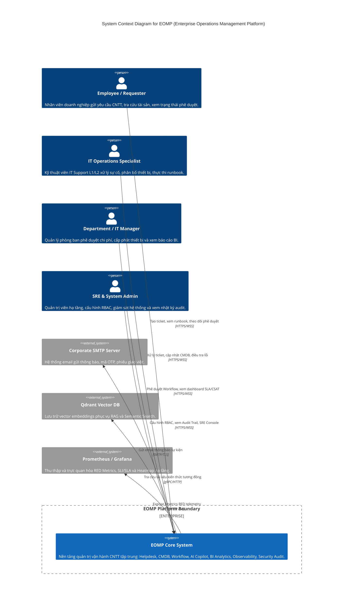
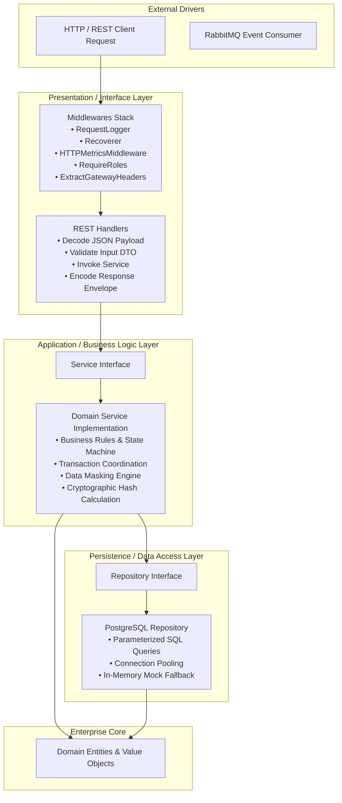
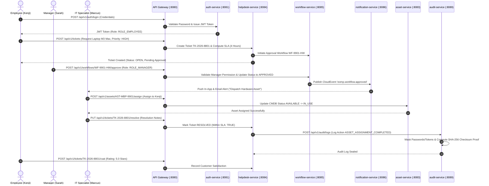

# EOMP C4 Model Architecture Blueprints & System Design

Tài liệu này đặc tả toàn bộ kiến trúc hệ thống **EOMP (Enterprise Operations Management Platform)** theo chuẩn mô hình kiến trúc **C4 Model (Context, Container, Component, Code)** tiêu chuẩn quốc tế.

---

## 1. 🌐 Level 1: System Context Diagram

Sơ đồ ngữ cảnh hệ thống định nghĩa ranh giới nền tảng EOMP và mối quan hệ tương tác với người dùng nội bộ và các hệ thống bên ngoài.



---

## 2. 📦 Level 2: Container Diagram

Sơ đồ Container mô tả cấu trúc chi tiết 11 Microservices Go, API Gateway, 8 Cơ sở dữ liệu phân tán PostgreSQL, Message Brokers và Frontend Nuxt 4.

```mermaid
graph TD
    subgraph Client Layer
        Web[Nuxt 4 SPA / SSR Web Client<br/>Port 3000<br/>Vue 3 + TailwindCSS + TypeScript]
    end

    subgraph Edge & Security Boundary
        GW[API Gateway Router<br/>Port 8080 (Golang)<br/>JWT Auth, Strict RBAC, Rate Limiter, Reverse Proxy]
    end

    Web -->|HTTPS REST / WebSocket| GW

    subgraph Core Microservices Layer Golang 1.25
        AuthSvc[auth-service :8081<br/>JWT/RBAC, MFA]
        EmpSvc[employee-service :8082<br/>Org Chart, Departments]
        AssetSvc[asset-service :8083<br/>CMDB, Hardware Lifecycle]
        HelpdeskSvc[helpdesk-service :8084<br/>Incidents, Service Catalog]
        WfSvc[workflow-service :8085<br/>Approval State Machine]
        NotifSvc[notification-service :8086<br/>In-App & Email Alerts]
        KnowSvc[knowledge-service :8087<br/>Runbooks, Articles]
        AISvc[ai-service :8088<br/>RAG Engine, Copilot]
        AuditSvc[audit-service :8089<br/>Immutable SHA-256 Audit Trail]
        ReportSvc[reporting-service :8090<br/>BI Analytics, MTTR/MTTD, SLA]
    end

    GW -->|/api/v1/auth| AuthSvc
    GW -->|/api/v1/employees| EmpSvc
    GW -->|/api/v1/assets| AssetSvc
    GW -->|/api/v1/tickets| HelpdeskSvc
    GW -->|/api/v1/workflows| WfSvc
    GW -->|/api/v1/notifications| NotifSvc
    GW -->|/api/v1/knowledge| KnowSvc
    GW -->|/api/v1/ai| AISvc
    GW -->|/api/v1/audit| AuditSvc
    GW -->|/api/v1/reports| ReportSvc

    subgraph Persistence & Infrastructure Layer
        DB_Auth[(auth_db<br/>Postgres)]
        DB_Emp[(employee_db<br/>Postgres)]
        DB_Asset[(asset_db<br/>Postgres)]
        DB_Helpdesk[(helpdesk_db<br/>Postgres)]
        DB_Wf[(workflow_db<br/>Postgres)]
        DB_Know[(knowledge_db<br/>Postgres)]
        DB_Audit[(audit_db<br/>Postgres)]
        DB_Report[(reporting_db<br/>Postgres)]

        RedisCache[(Redis Cluster :6379<br/>Sessions, Rate Limits, Cache)]
        EventBus[(RabbitMQ :5672<br/>CloudEvents Message Bus)]
        QdrantDB[(Qdrant Vector DB :6333<br/>Vector Embeddings)]
        MinIO[(MinIO Object Storage :9000<br/>Attachments, Exports)]
        Prometheus[(Prometheus :9090<br/>Telemetry Collector)]
        Grafana[(Grafana :3002<br/>SRE Dashboards)]
    end

    AuthSvc --> DB_Auth
    EmpSvc --> DB_Emp
    AssetSvc --> DB_Asset
    HelpdeskSvc --> DB_Helpdesk
    WfSvc --> DB_Wf
    KnowSvc --> DB_Know
    AuditSvc --> DB_Audit
    ReportSvc --> DB_Report

    HelpdeskSvc -.->|Publish Events| EventBus
    WfSvc -.->|Publish Events| EventBus
    EventBus -.->|Consume Events| NotifSvc
    AISvc --> QdrantDB
    KnowSvc --> MinIO
    GW --> RedisCache
    Prometheus -->|Scrape /metrics| GW
    Grafana --> Prometheus
```

---

## 3. 🧩 Level 3: Component Diagram (Clean Architecture)

Tất cả các microservices trong hệ thống EOMP đều tuân thủ kiến trúc **Clean Architecture (Onion Architecture)** phân tầng nghiêm ngặt:



---

## 4. 🔄 Level 4: Enterprise Cross-Service Dynamic Lifecycle Diagram

Sơ đồ tuần tự thể hiện sự phối hợp nhịp nhàng giữa 7 microservices khi thực thi một quy trình kinh doanh hoàn chỉnh:


