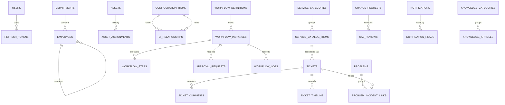

# EOMP Master Database ERD & Data Dictionary

Last audited: 2026-08-30

Tài liệu này phản ánh 9 PostgreSQL database và các bảng hiện có trong migration của repository. Quan hệ trong sơ đồ là quan hệ nội bộ từng database; các đường nghiệp vụ liên service không phải foreign key.

## ERD tổng quan

## Từ điển aggregate chính

| Database / bảng | Khóa và trường quan trọng | Quy tắc hiện hành |
|---|---|---|
| `auth_db.users` | UUID `id`, unique `email`, `password_hash`, `role`, `department_id`, `is_active` | Đăng ký công khai luôn tạo `ROLE_EMPLOYEE`; mật khẩu lưu bcrypt |
| `auth_db.refresh_tokens` | token hash, user ID, expiry/revocation | refresh rotation xác minh signature, issuer, expiry, subject và token type |
| `employee_db.departments` | UUID `id`, unique `code`, `manager_id` | `manager_id` là quan hệ tổ chức tùy chọn |
| `employee_db.employees` | UUID `id`, unique `user_id`/`email`, first/last name, `department_id`, `manager_id`, `version` | update/delete yêu cầu version hiện tại |
| `asset_db.assets` | UUID `id`, unique `asset_tag`, serial/status/assignment, `version` | update/delete dùng CAS |
| `asset_db.configuration_items` | UUID `id`, unique `ci_code`, type/status/owner, `version` | CMDB update dùng CAS |
| `asset_db.ci_relationships` | parent CI, child CI, relationship type | foreign key chỉ nằm trong `asset_db` |
| `helpdesk_db.tickets` | UUID `id`, unique `ticket_number`, requester/assignee, SLA/status, `version` | requester lấy từ JWT; employee chỉ đọc ticket của mình; update dùng CAS; số TK dùng sequence |
| `helpdesk_db.ticket_comments` | ticket ID, author, body, `is_internal` | employee không được tạo hoặc xem comment nội bộ |
| `helpdesk_db.problems` | UUID `id`, unique problem number, RCA/status, `version` | update dùng CAS; số PRB dùng sequence |
| `workflow_db.workflow_definitions` | UUID `id`, unique `code`, JSONB `steps_config` | approval đầu tiên lấy name/role từ cấu hình |
| `workflow_db.workflow_instances` | UUID `id`, unique `instance_number`, requester, status, `version` | employee chỉ xem instance/log của mình; số WFI dùng sequence |
| `workflow_db.approval_requests` | instance ID, approver ID/role, status/deadline | quyết định chỉ bởi assigned user, role pool hoặc admin; ghi cùng instance bằng transaction |
| `workflow_db.change_requests` | UUID `id`, unique `change_number`, risk/status, requester, `version` | CAB/status chỉ manager/admin; requester/reviewer lấy từ JWT; số CHG dùng sequence |
| `workflow_db.cab_reviews` | change ID, unique reviewer per change, vote | chống giả mạo reviewer ở handler |
| `notification_db.notifications` | UUID `id`, recipient, type/title/body | record có thể dành cho một recipient hoặc broadcast |
| `notification_db.notification_reads` | composite PK `(notification_id, recipient_id)`, `read_at` | receipt riêng cho mỗi người; ownership được kiểm tra khi mark read |
| `knowledge_db.knowledge_articles` | UUID `id`, unique `slug`, title/summary/content/tags, `is_published`, `version` | update/delete dùng CAS; search hiện dùng PostgreSQL |
| `knowledge_db.runbooks` | UUID `id`, code/title/steps | nội dung SOP thực, không trả fixture giả khi search lỗi |
| `audit_db.audit_logs` | `audit_sequence`, payload actor/resource, `previous_checksum`, checksum, algorithm | chuỗi HMAC-SHA256 và trigger append-only |
| `audit_db.security_events` | UUID `id`, type/severity/source/status | sự kiện bảo mật tách khỏi audit trail nghiệp vụ |
| `reporting_db.*` | ngày/kỳ, dimension và KPI aggregate | dữ liệu phải đến từ pipeline thật; demo telemetry được cleanup bằng migration |

## Trường concurrency

Các bảng đã có optimistic concurrency trong API hiện tại:

- `employees`
- `assets`
- `configuration_items`
- `tickets`
- `problems`
- `workflow_instances` (khi approval advance)
- `change_requests`
- `knowledge_articles`

Client gửi version đang thấy. Repository cập nhật bằng `WHERE id = ? AND version = ?`, tăng `version` trong cùng statement và trả HTTP 409 nếu không có row phù hợp.

## Lưu ý kiểm chứng

Migration đã được kiểm tra tĩnh, Go test/vet và OpenAPI gate đã đạt. Lần audit này chưa chạy fresh-install/upgrade migration trên PostgreSQL thật vì Docker daemon không khả dụng; đây vẫn là điều kiện bắt buộc trước release.
