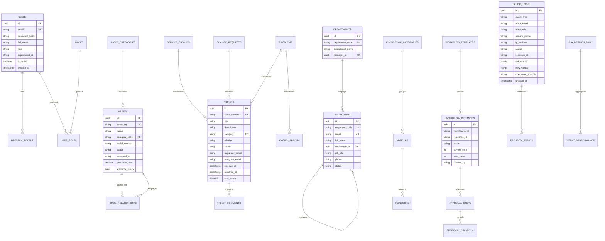

# EOMP Master Database ERD & Data Dictionary

Tài liệu này đặc tả chi tiết toàn bộ cấu trúc dữ liệu, sơ đồ thực thể quan hệ (**Entity Relationship Diagram - ERD**) và từ điển dữ liệu (**Data Dictionary**) của **8 cơ sở dữ liệu phân tán PostgreSQL** trong nền tảng **EOMP**.

---

## 1. 🗄️ Sơ Đồ Thực Thể Quan Hệ Tổng Thể (Master Database ERD)

---

## 2. 📚 Từ Điển Dữ Liệu Chi Tiết (Data Dictionary)

### 2.1. `auth_db` — Định Danh & Xác Thực (Identity & Access)
| Tên Cột | Kiểu Dữ Liệu | Ràng Buộc | Ý Nghĩa / Mục Đích |
|---|---|---|---|
| `id` | `UUID` | `PRIMARY KEY` | Khóa chính duy nhất của người dùng |
| `email` | `VARCHAR(150)` | `UNIQUE, NOT NULL` | Địa chỉ email đăng nhập công ty |
| `password_hash` | `VARCHAR(255)` | `NOT NULL` | Mật khẩu băm chuẩn bcrypt |
| `full_name` | `VARCHAR(150)` | `NOT NULL` | Họ và tên đầy đủ |
| `role` | `VARCHAR(50)` | `NOT NULL` | Vai trò bảo mật (`ROLE_ADMIN`, `ROLE_MANAGER`, `ROLE_AGENT`, `ROLE_EMPLOYEE`) |
| `department_id` | `VARCHAR(50)` | `NULL` | Mã phòng ban trực thuộc |
| `is_active` | `BOOLEAN` | `DEFAULT TRUE` | Trạng thái kích hoạt tài khoản |
| `created_at` | `TIMESTAMP` | `DEFAULT NOW()` | Thời gian tạo tài khoản |

---

### 2.2. `asset_db` — Quản Lý Tài Sản & Cấu Hình CMDB
| Tên Cột | Kiểu Dữ Liệu | Ràng Buộc | Ý Nghĩa / Mục Đích |
|---|---|---|---|
| `id` | `UUID` | `PRIMARY KEY` | Khóa chính tài sản |
| `asset_tag` | `VARCHAR(50)` | `UNIQUE, NOT NULL` | Mã định danh tài sản vật lý (Barcode/QR) |
| `name` | `VARCHAR(255)` | `NOT NULL` | Tên trang thiết bị (vd: MacBook Pro 16" M3 Max) |
| `category` | `VARCHAR(50)` | `NOT NULL` | Danh mục thiết bị (`LAPTOP`, `SERVER`, `NETWORK_SWITCH`, `MONITOR`) |
| `serial_number` | `VARCHAR(100)` | `NOT NULL` | Số sê-ri nhà sản xuất |
| `status` | `VARCHAR(50)` | `NOT NULL` | Trạng thái vòng đời (`AVAILABLE`, `IN_USE`, `IN_MAINTENANCE`, `RETIRED`, `DISPOSED`) |
| `assigned_to` | `VARCHAR(150)` | `NULL` | Email nhân viên đang nắm giữ thiết bị |
| `purchase_cost` | `DECIMAL(12,2)` | `DEFAULT 0.00` | Giá trị nguyên giá mua vào (VND/USD) |
| `warranty_expiry`| `DATE` | `NULL` | Ngày hết hạn bảo hành chính hãng |

---

### 2.3. `helpdesk_db` — Quản Lý Sự Cố, Yêu Cầu & ITIL
| Tên Cột | Kiểu Dữ Liệu | Ràng Buộc | Ý Nghĩa / Mục Đích |
|---|---|---|---|
| `id` | `UUID` | `PRIMARY KEY` | Khóa chính ticket |
| `ticket_number` | `VARCHAR(50)` | `UNIQUE, NOT NULL` | Mã phiếu sự cố hiển thị (vd: `TK-2026-8801`) |
| `title` | `VARCHAR(255)` | `NOT NULL` | Tiêu đề tóm tắt sự cố hoặc yêu cầu |
| `description` | `TEXT` | `NOT NULL` | Nội dung mô tả chi tiết |
| `category` | `VARCHAR(50)` | `NOT NULL` | Danh mục sự cố (`hardware`, `network`, `software`, `security`) |
| `priority` | `VARCHAR(50)` | `NOT NULL` | Mức độ ưu tiên (`URGENT`, `HIGH`, `MEDIUM`, `LOW`) |
| `status` | `VARCHAR(50)` | `NOT NULL` | Trạng thái xử lý (`OPEN`, `IN_PROGRESS`, `PENDING_APPROVAL`, `RESOLVED`, `CLOSED`) |
| `requester_email`| `VARCHAR(150)` | `NOT NULL` | Email người gửi yêu cầu |
| `assignee_email` | `VARCHAR(150)` | `NULL` | Email kỹ thuật viên tiếp nhận xử lý |
| `sla_due_at` | `TIMESTAMP` | `NOT NULL` | Hạn xử lý tối đa theo cam kết SLA |
| `resolved_at` | `TIMESTAMP` | `NULL` | Thời điểm hoàn thành xử lý |
| `csat_score` | `DECIMAL(3,2)` | `NULL` | Điểm đánh giá mức độ hài lòng (1.00 - 5.00) |

---

### 2.4. `audit_db` — Nhật Ký Kiểm Toán Bất Biến (Immutable SOC2 Trail)
| Tên Cột | Kiểu Dữ Liệu | Ràng Buộc | Ý Nghĩa / Mục Đích |
|---|---|---|---|
| `id` | `UUID` | `PRIMARY KEY` | Khóa chính bản ghi kiểm toán |
| `event_type` | `VARCHAR(100)` | `NOT NULL` | Loại hành vi (`LOGIN`, `ROLE_CHANGE`, `ASSET_DELETE`, `APPROVAL_DECISION`) |
| `actor_email` | `VARCHAR(150)` | `NOT NULL` | Email người thực thi |
| `actor_role` | `VARCHAR(50)` | `NOT NULL` | Quyền hạn lúc thực thi (`ROLE_ADMIN`, `ROLE_MANAGER`,...) |
| `service_name` | `VARCHAR(50)` | `NOT NULL` | Tên microservice phát sinh sự kiện |
| `ip_address` | `VARCHAR(50)` | `NOT NULL` | Địa chỉ IP của máy khách |
| `status` | `VARCHAR(50)` | `NOT NULL` | Kết quả hành vi (`SUCCESS`, `FORBIDDEN`, `FAILED`) |
| `resource_id` | `VARCHAR(100)` | `NOT NULL` | Mã tài nguyên bị tác động |
| `old_values` | `JSONB` | `NULL` | Dữ liệu trước khi sửa (đã qua Data Masking) |
| `new_values` | `JSONB` | `NULL` | Dữ liệu sau khi sửa (đã qua Data Masking) |
| `checksum_sha256`| `VARCHAR(64)` | `NOT NULL` | Mã băm SHA-256 niêm phong bất biến |
| `created_at` | `TIMESTAMP` | `DEFAULT NOW()` | Thời gian phát sinh sự kiện |
